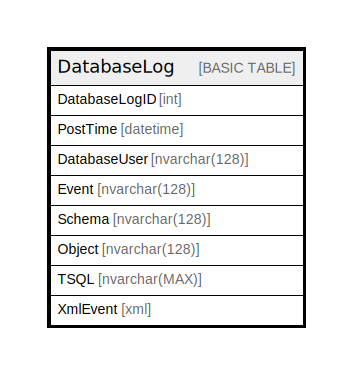

# DatabaseLog

## Description

## Columns

| Name | Type | Default | Nullable | Children | Parents | Comment |
| ---- | ---- | ------- | -------- | -------- | ------- | ------- |
| DatabaseLogID | int |  | false |  |  |  |
| PostTime | datetime |  | false |  |  |  |
| DatabaseUser | nvarchar(128) |  | false |  |  |  |
| Event | nvarchar(128) |  | false |  |  |  |
| Schema | nvarchar(128) |  | true |  |  |  |
| Object | nvarchar(128) |  | true |  |  |  |
| TSQL | nvarchar(MAX) |  | false |  |  |  |
| XmlEvent | xml |  | false |  |  |  |

## Constraints

| Name | Type | Definition |
| ---- | ---- | ---------- |
| PK_DatabaseLog_DatabaseLogID | PRIMARY KEY | NONCLUSTERED, unique, part of a PRIMARY KEY constraint, [ DatabaseLogID ] |

## Indexes

| Name | Definition |
| ---- | ---------- |
| PK_DatabaseLog_DatabaseLogID | NONCLUSTERED, unique, part of a PRIMARY KEY constraint, [ DatabaseLogID ] |

## Relations

---

> Generated by [tbls](https://github.com/k1LoW/tbls)
