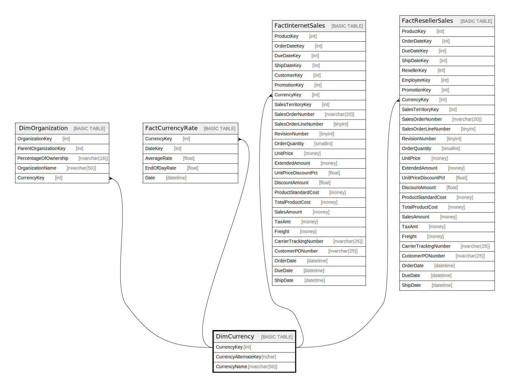

# DimCurrency

## Description

## Columns

| Name | Type | Default | Nullable | Children | Parents | Comment |
| ---- | ---- | ------- | -------- | -------- | ------- | ------- |
| CurrencyKey | int |  | false | [DimOrganization](DimOrganization.md) [FactCurrencyRate](FactCurrencyRate.md) [FactInternetSales](FactInternetSales.md) [FactResellerSales](FactResellerSales.md) |  |  |
| CurrencyAlternateKey | nchar |  | false |  |  |  |
| CurrencyName | nvarchar(50) |  | false |  |  |  |

## Constraints

| Name | Type | Definition |
| ---- | ---- | ---------- |
| PK_DimCurrency_CurrencyKey | PRIMARY KEY | CLUSTERED, unique, part of a PRIMARY KEY constraint, [ CurrencyKey ] |

## Indexes

| Name | Definition |
| ---- | ---------- |
| PK_DimCurrency_CurrencyKey | CLUSTERED, unique, part of a PRIMARY KEY constraint, [ CurrencyKey ] |
| AK_DimCurrency_CurrencyAlternateKey | NONCLUSTERED, unique, [ CurrencyAlternateKey ] |

## Relations

---

> Generated by [tbls](https://github.com/k1LoW/tbls)
