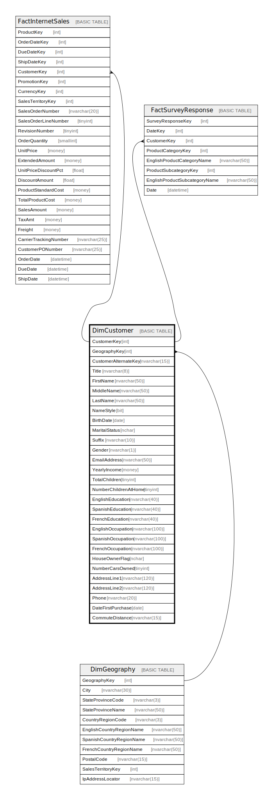

# DimCustomer

## Description

## Columns

| Name | Type | Default | Nullable | Children | Parents | Comment |
| ---- | ---- | ------- | -------- | -------- | ------- | ------- |
| CustomerKey | int |  | false | [FactInternetSales](FactInternetSales.md) [FactSurveyResponse](FactSurveyResponse.md) |  |  |
| GeographyKey | int |  | true |  | [DimGeography](DimGeography.md) |  |
| CustomerAlternateKey | nvarchar(15) |  | false |  |  |  |
| Title | nvarchar(8) |  | true |  |  |  |
| FirstName | nvarchar(50) |  | true |  |  |  |
| MiddleName | nvarchar(50) |  | true |  |  |  |
| LastName | nvarchar(50) |  | true |  |  |  |
| NameStyle | bit |  | true |  |  |  |
| BirthDate | date |  | true |  |  |  |
| MaritalStatus | nchar |  | true |  |  |  |
| Suffix | nvarchar(10) |  | true |  |  |  |
| Gender | nvarchar(1) |  | true |  |  |  |
| EmailAddress | nvarchar(50) |  | true |  |  |  |
| YearlyIncome | money |  | true |  |  |  |
| TotalChildren | tinyint |  | true |  |  |  |
| NumberChildrenAtHome | tinyint |  | true |  |  |  |
| EnglishEducation | nvarchar(40) |  | true |  |  |  |
| SpanishEducation | nvarchar(40) |  | true |  |  |  |
| FrenchEducation | nvarchar(40) |  | true |  |  |  |
| EnglishOccupation | nvarchar(100) |  | true |  |  |  |
| SpanishOccupation | nvarchar(100) |  | true |  |  |  |
| FrenchOccupation | nvarchar(100) |  | true |  |  |  |
| HouseOwnerFlag | nchar |  | true |  |  |  |
| NumberCarsOwned | tinyint |  | true |  |  |  |
| AddressLine1 | nvarchar(120) |  | true |  |  |  |
| AddressLine2 | nvarchar(120) |  | true |  |  |  |
| Phone | nvarchar(20) |  | true |  |  |  |
| DateFirstPurchase | date |  | true |  |  |  |
| CommuteDistance | nvarchar(15) |  | true |  |  |  |

## Constraints

| Name | Type | Definition |
| ---- | ---- | ---------- |
| PK_DimCustomer_CustomerKey | PRIMARY KEY | CLUSTERED, unique, part of a PRIMARY KEY constraint, [ CustomerKey ] |
| FK_DimCustomer_DimGeography | FOREIGN KEY | FOREIGN KEY(GeographyKey) REFERENCES DimGeography(GeographyKey) ON UPDATE NO_ACTION ON DELETE NO_ACTION |

## Indexes

| Name | Definition |
| ---- | ---------- |
| PK_DimCustomer_CustomerKey | CLUSTERED, unique, part of a PRIMARY KEY constraint, [ CustomerKey ] |
| IX_DimCustomer_CustomerAlternateKey | NONCLUSTERED, unique, [ CustomerAlternateKey ] |

## Relations

---

> Generated by [tbls](https://github.com/k1LoW/tbls)
