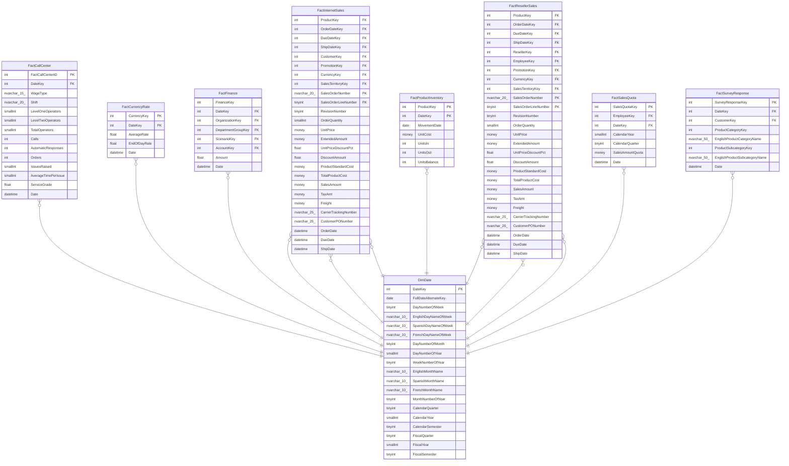

# DimDate

## Description

## Columns

| Name | Type | Default | Nullable | Children | Parents | Comment |
| ---- | ---- | ------- | -------- | -------- | ------- | ------- |
| DateKey | int |  | false | [FactCallCenter](FactCallCenter.md) [FactCurrencyRate](FactCurrencyRate.md) [FactFinance](FactFinance.md) [FactInternetSales](FactInternetSales.md) [FactProductInventory](FactProductInventory.md) [FactResellerSales](FactResellerSales.md) [FactSalesQuota](FactSalesQuota.md) [FactSurveyResponse](FactSurveyResponse.md) |  |  |
| FullDateAlternateKey | date |  | false |  |  |  |
| DayNumberOfWeek | tinyint |  | false |  |  |  |
| EnglishDayNameOfWeek | nvarchar(10) |  | false |  |  |  |
| SpanishDayNameOfWeek | nvarchar(10) |  | false |  |  |  |
| FrenchDayNameOfWeek | nvarchar(10) |  | false |  |  |  |
| DayNumberOfMonth | tinyint |  | false |  |  |  |
| DayNumberOfYear | smallint |  | false |  |  |  |
| WeekNumberOfYear | tinyint |  | false |  |  |  |
| EnglishMonthName | nvarchar(10) |  | false |  |  |  |
| SpanishMonthName | nvarchar(10) |  | false |  |  |  |
| FrenchMonthName | nvarchar(10) |  | false |  |  |  |
| MonthNumberOfYear | tinyint |  | false |  |  |  |
| CalendarQuarter | tinyint |  | false |  |  |  |
| CalendarYear | smallint |  | false |  |  |  |
| CalendarSemester | tinyint |  | false |  |  |  |
| FiscalQuarter | tinyint |  | false |  |  |  |
| FiscalYear | smallint |  | false |  |  |  |
| FiscalSemester | tinyint |  | false |  |  |  |

## Constraints

| Name | Type | Definition |
| ---- | ---- | ---------- |
| PK_DimDate_DateKey | PRIMARY KEY | CLUSTERED, unique, part of a PRIMARY KEY constraint, [ DateKey ] |

## Indexes

| Name | Definition |
| ---- | ---------- |
| PK_DimDate_DateKey | CLUSTERED, unique, part of a PRIMARY KEY constraint, [ DateKey ] |
| AK_DimDate_FullDateAlternateKey | NONCLUSTERED, unique, [ FullDateAlternateKey ] |

## Relations

---

> Generated by [tbls](https://github.com/k1LoW/tbls)
