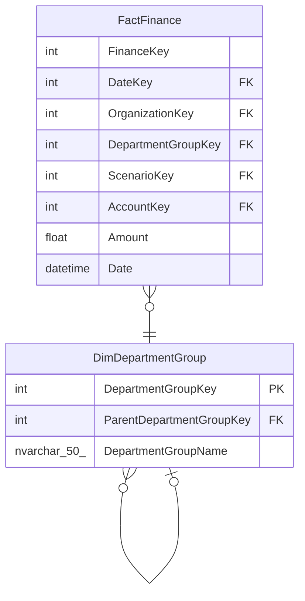

# DimDepartmentGroup

## Description

## Columns

| Name | Type | Default | Nullable | Children | Parents | Comment |
| ---- | ---- | ------- | -------- | -------- | ------- | ------- |
| DepartmentGroupKey | int |  | false | [DimDepartmentGroup](DimDepartmentGroup.md) [FactFinance](FactFinance.md) |  |  |
| ParentDepartmentGroupKey | int |  | true |  | [DimDepartmentGroup](DimDepartmentGroup.md) |  |
| DepartmentGroupName | nvarchar(50) |  | true |  |  |  |

## Constraints

| Name | Type | Definition |
| ---- | ---- | ---------- |
| PK_DimDepartmentGroup | PRIMARY KEY | CLUSTERED, unique, part of a PRIMARY KEY constraint, [ DepartmentGroupKey ] |
| FK_DimDepartmentGroup_DimDepartmentGroup | FOREIGN KEY | FOREIGN KEY(ParentDepartmentGroupKey) REFERENCES DimDepartmentGroup(DepartmentGroupKey) ON UPDATE NO_ACTION ON DELETE NO_ACTION |

## Indexes

| Name | Definition |
| ---- | ---------- |
| PK_DimDepartmentGroup | CLUSTERED, unique, part of a PRIMARY KEY constraint, [ DepartmentGroupKey ] |

## Relations

---

> Generated by [tbls](https://github.com/k1LoW/tbls)
