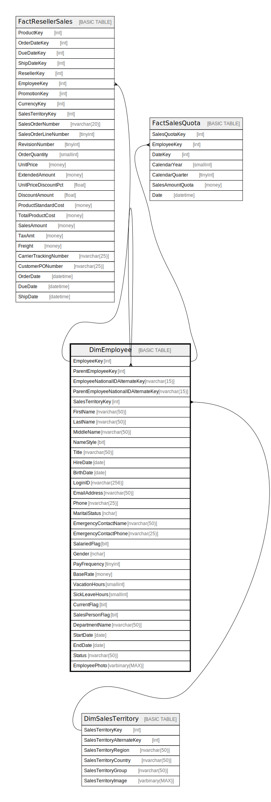

# DimEmployee

## Description

## Columns

| Name | Type | Default | Nullable | Children | Parents | Comment |
| ---- | ---- | ------- | -------- | -------- | ------- | ------- |
| EmployeeKey | int |  | false | [DimEmployee](DimEmployee.md) [FactResellerSales](FactResellerSales.md) [FactSalesQuota](FactSalesQuota.md) |  |  |
| ParentEmployeeKey | int |  | true |  | [DimEmployee](DimEmployee.md) |  |
| EmployeeNationalIDAlternateKey | nvarchar(15) |  | true |  |  |  |
| ParentEmployeeNationalIDAlternateKey | nvarchar(15) |  | true |  |  |  |
| SalesTerritoryKey | int |  | true |  | [DimSalesTerritory](DimSalesTerritory.md) |  |
| FirstName | nvarchar(50) |  | false |  |  |  |
| LastName | nvarchar(50) |  | false |  |  |  |
| MiddleName | nvarchar(50) |  | true |  |  |  |
| NameStyle | bit |  | false |  |  |  |
| Title | nvarchar(50) |  | true |  |  |  |
| HireDate | date |  | true |  |  |  |
| BirthDate | date |  | true |  |  |  |
| LoginID | nvarchar(256) |  | true |  |  |  |
| EmailAddress | nvarchar(50) |  | true |  |  |  |
| Phone | nvarchar(25) |  | true |  |  |  |
| MaritalStatus | nchar |  | true |  |  |  |
| EmergencyContactName | nvarchar(50) |  | true |  |  |  |
| EmergencyContactPhone | nvarchar(25) |  | true |  |  |  |
| SalariedFlag | bit |  | true |  |  |  |
| Gender | nchar |  | true |  |  |  |
| PayFrequency | tinyint |  | true |  |  |  |
| BaseRate | money |  | true |  |  |  |
| VacationHours | smallint |  | true |  |  |  |
| SickLeaveHours | smallint |  | true |  |  |  |
| CurrentFlag | bit |  | false |  |  |  |
| SalesPersonFlag | bit |  | false |  |  |  |
| DepartmentName | nvarchar(50) |  | true |  |  |  |
| StartDate | date |  | true |  |  |  |
| EndDate | date |  | true |  |  |  |
| Status | nvarchar(50) |  | true |  |  |  |
| EmployeePhoto | varbinary(MAX) |  | true |  |  |  |

## Constraints

| Name | Type | Definition |
| ---- | ---- | ---------- |
| PK_DimEmployee_EmployeeKey | PRIMARY KEY | CLUSTERED, unique, part of a PRIMARY KEY constraint, [ EmployeeKey ] |
| FK_DimEmployee_DimEmployee | FOREIGN KEY | FOREIGN KEY(ParentEmployeeKey) REFERENCES DimEmployee(EmployeeKey) ON UPDATE NO_ACTION ON DELETE NO_ACTION |
| FK_DimEmployee_DimSalesTerritory | FOREIGN KEY | FOREIGN KEY(SalesTerritoryKey) REFERENCES DimSalesTerritory(SalesTerritoryKey) ON UPDATE NO_ACTION ON DELETE NO_ACTION |

## Indexes

| Name | Definition |
| ---- | ---------- |
| PK_DimEmployee_EmployeeKey | CLUSTERED, unique, part of a PRIMARY KEY constraint, [ EmployeeKey ] |

## Relations

---

> Generated by [tbls](https://github.com/k1LoW/tbls)
