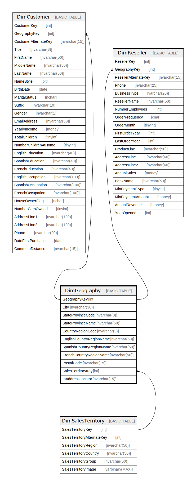

# DimGeography

## Description

## Columns

| Name | Type | Default | Nullable | Children | Parents | Comment |
| ---- | ---- | ------- | -------- | -------- | ------- | ------- |
| GeographyKey | int |  | false | [DimCustomer](DimCustomer.md) [DimReseller](DimReseller.md) |  |  |
| City | nvarchar(30) |  | true |  |  |  |
| StateProvinceCode | nvarchar(3) |  | true |  |  |  |
| StateProvinceName | nvarchar(50) |  | true |  |  |  |
| CountryRegionCode | nvarchar(3) |  | true |  |  |  |
| EnglishCountryRegionName | nvarchar(50) |  | true |  |  |  |
| SpanishCountryRegionName | nvarchar(50) |  | true |  |  |  |
| FrenchCountryRegionName | nvarchar(50) |  | true |  |  |  |
| PostalCode | nvarchar(15) |  | true |  |  |  |
| SalesTerritoryKey | int |  | true |  | [DimSalesTerritory](DimSalesTerritory.md) |  |
| IpAddressLocator | nvarchar(15) |  | true |  |  |  |

## Constraints

| Name | Type | Definition |
| ---- | ---- | ---------- |
| PK_DimGeography_GeographyKey | PRIMARY KEY | CLUSTERED, unique, part of a PRIMARY KEY constraint, [ GeographyKey ] |
| FK_DimGeography_DimSalesTerritory | FOREIGN KEY | FOREIGN KEY(SalesTerritoryKey) REFERENCES DimSalesTerritory(SalesTerritoryKey) ON UPDATE NO_ACTION ON DELETE NO_ACTION |

## Indexes

| Name | Definition |
| ---- | ---------- |
| PK_DimGeography_GeographyKey | CLUSTERED, unique, part of a PRIMARY KEY constraint, [ GeographyKey ] |

## Relations

---

> Generated by [tbls](https://github.com/k1LoW/tbls)
