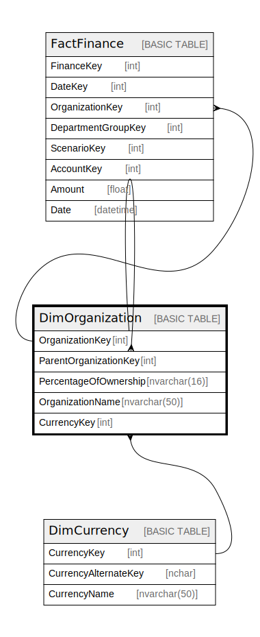

# DimOrganization

## Description

## Columns

| Name | Type | Default | Nullable | Children | Parents | Comment |
| ---- | ---- | ------- | -------- | -------- | ------- | ------- |
| OrganizationKey | int |  | false | [DimOrganization](DimOrganization.md) [FactFinance](FactFinance.md) |  |  |
| ParentOrganizationKey | int |  | true |  | [DimOrganization](DimOrganization.md) |  |
| PercentageOfOwnership | nvarchar(16) |  | true |  |  |  |
| OrganizationName | nvarchar(50) |  | true |  |  |  |
| CurrencyKey | int |  | true |  | [DimCurrency](DimCurrency.md) |  |

## Constraints

| Name | Type | Definition |
| ---- | ---- | ---------- |
| PK_DimOrganization | PRIMARY KEY | CLUSTERED, unique, part of a PRIMARY KEY constraint, [ OrganizationKey ] |
| FK_DimOrganization_DimCurrency | FOREIGN KEY | FOREIGN KEY(CurrencyKey) REFERENCES DimCurrency(CurrencyKey) ON UPDATE NO_ACTION ON DELETE NO_ACTION |
| FK_DimOrganization_DimOrganization | FOREIGN KEY | FOREIGN KEY(ParentOrganizationKey) REFERENCES DimOrganization(OrganizationKey) ON UPDATE NO_ACTION ON DELETE NO_ACTION |

## Indexes

| Name | Definition |
| ---- | ---------- |
| PK_DimOrganization | CLUSTERED, unique, part of a PRIMARY KEY constraint, [ OrganizationKey ] |

## Relations

---

> Generated by [tbls](https://github.com/k1LoW/tbls)
