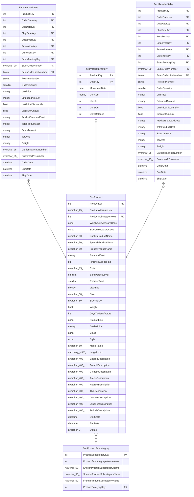

# DimProduct

## Description

## Columns

| Name | Type | Default | Nullable | Children | Parents | Comment |
| ---- | ---- | ------- | -------- | -------- | ------- | ------- |
| ProductKey | int |  | false | [FactInternetSales](FactInternetSales.md) [FactProductInventory](FactProductInventory.md) [FactResellerSales](FactResellerSales.md) |  |  |
| ProductAlternateKey | nvarchar(25) |  | true |  |  |  |
| ProductSubcategoryKey | int |  | true |  | [DimProductSubcategory](DimProductSubcategory.md) |  |
| WeightUnitMeasureCode | nchar |  | true |  |  |  |
| SizeUnitMeasureCode | nchar |  | true |  |  |  |
| EnglishProductName | nvarchar(50) |  | false |  |  |  |
| SpanishProductName | nvarchar(50) |  | false |  |  |  |
| FrenchProductName | nvarchar(50) |  | false |  |  |  |
| StandardCost | money |  | true |  |  |  |
| FinishedGoodsFlag | bit |  | false |  |  |  |
| Color | nvarchar(15) |  | false |  |  |  |
| SafetyStockLevel | smallint |  | true |  |  |  |
| ReorderPoint | smallint |  | true |  |  |  |
| ListPrice | money |  | true |  |  |  |
| Size | nvarchar(50) |  | true |  |  |  |
| SizeRange | nvarchar(50) |  | true |  |  |  |
| Weight | float |  | true |  |  |  |
| DaysToManufacture | int |  | true |  |  |  |
| ProductLine | nchar |  | true |  |  |  |
| DealerPrice | money |  | true |  |  |  |
| Class | nchar |  | true |  |  |  |
| Style | nchar |  | true |  |  |  |
| ModelName | nvarchar(50) |  | true |  |  |  |
| LargePhoto | varbinary(MAX) |  | true |  |  |  |
| EnglishDescription | nvarchar(400) |  | true |  |  |  |
| FrenchDescription | nvarchar(400) |  | true |  |  |  |
| ChineseDescription | nvarchar(400) |  | true |  |  |  |
| ArabicDescription | nvarchar(400) |  | true |  |  |  |
| HebrewDescription | nvarchar(400) |  | true |  |  |  |
| ThaiDescription | nvarchar(400) |  | true |  |  |  |
| GermanDescription | nvarchar(400) |  | true |  |  |  |
| JapaneseDescription | nvarchar(400) |  | true |  |  |  |
| TurkishDescription | nvarchar(400) |  | true |  |  |  |
| StartDate | datetime |  | true |  |  |  |
| EndDate | datetime |  | true |  |  |  |
| Status | nvarchar(7) |  | true |  |  |  |

## Constraints

| Name | Type | Definition |
| ---- | ---- | ---------- |
| PK_DimProduct_ProductKey | PRIMARY KEY | CLUSTERED, unique, part of a PRIMARY KEY constraint, [ ProductKey ] |
| AK_DimProduct_ProductAlternateKey_StartDate | UNIQUE | NONCLUSTERED, unique, part of a UNIQUE constraint, [ ProductAlternateKey, StartDate ] |
| FK_DimProduct_DimProductSubcategory | FOREIGN KEY | FOREIGN KEY(ProductSubcategoryKey) REFERENCES DimProductSubcategory(ProductSubcategoryKey) ON UPDATE NO_ACTION ON DELETE NO_ACTION |

## Indexes

| Name | Definition |
| ---- | ---------- |
| PK_DimProduct_ProductKey | CLUSTERED, unique, part of a PRIMARY KEY constraint, [ ProductKey ] |
| AK_DimProduct_ProductAlternateKey_StartDate | NONCLUSTERED, unique, part of a UNIQUE constraint, [ ProductAlternateKey, StartDate ] |

## Relations

---

> Generated by [tbls](https://github.com/k1LoW/tbls)
