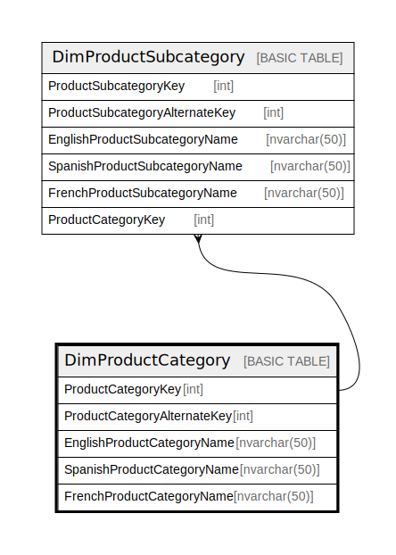

# DimProductCategory

## Description

## Columns

| Name | Type | Default | Nullable | Children | Parents | Comment |
| ---- | ---- | ------- | -------- | -------- | ------- | ------- |
| ProductCategoryKey | int |  | false | [DimProductSubcategory](DimProductSubcategory.md) |  |  |
| ProductCategoryAlternateKey | int |  | true |  |  |  |
| EnglishProductCategoryName | nvarchar(50) |  | false |  |  |  |
| SpanishProductCategoryName | nvarchar(50) |  | false |  |  |  |
| FrenchProductCategoryName | nvarchar(50) |  | false |  |  |  |

## Constraints

| Name | Type | Definition |
| ---- | ---- | ---------- |
| PK_DimProductCategory_ProductCategoryKey | PRIMARY KEY | CLUSTERED, unique, part of a PRIMARY KEY constraint, [ ProductCategoryKey ] |
| AK_DimProductCategory_ProductCategoryAlternateKey | UNIQUE | NONCLUSTERED, unique, part of a UNIQUE constraint, [ ProductCategoryAlternateKey ] |

## Indexes

| Name | Definition |
| ---- | ---------- |
| PK_DimProductCategory_ProductCategoryKey | CLUSTERED, unique, part of a PRIMARY KEY constraint, [ ProductCategoryKey ] |
| AK_DimProductCategory_ProductCategoryAlternateKey | NONCLUSTERED, unique, part of a UNIQUE constraint, [ ProductCategoryAlternateKey ] |

## Relations

---

> Generated by [tbls](https://github.com/k1LoW/tbls)
