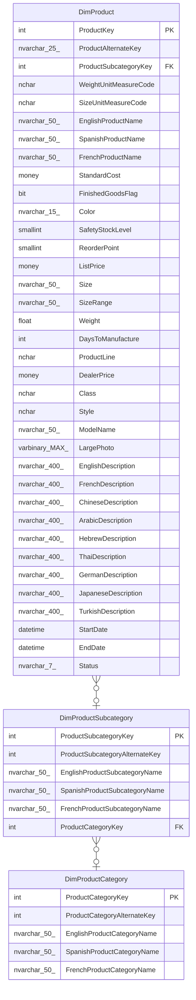

# DimProductSubcategory

## Description

## Columns

| Name | Type | Default | Nullable | Children | Parents | Comment |
| ---- | ---- | ------- | -------- | -------- | ------- | ------- |
| ProductSubcategoryKey | int |  | false | [DimProduct](DimProduct.md) |  |  |
| ProductSubcategoryAlternateKey | int |  | true |  |  |  |
| EnglishProductSubcategoryName | nvarchar(50) |  | false |  |  |  |
| SpanishProductSubcategoryName | nvarchar(50) |  | false |  |  |  |
| FrenchProductSubcategoryName | nvarchar(50) |  | false |  |  |  |
| ProductCategoryKey | int |  | true |  | [DimProductCategory](DimProductCategory.md) |  |

## Constraints

| Name | Type | Definition |
| ---- | ---- | ---------- |
| PK_DimProductSubcategory_ProductSubcategoryKey | PRIMARY KEY | CLUSTERED, unique, part of a PRIMARY KEY constraint, [ ProductSubcategoryKey ] |
| AK_DimProductSubcategory_ProductSubcategoryAlternateKey | UNIQUE | NONCLUSTERED, unique, part of a UNIQUE constraint, [ ProductSubcategoryAlternateKey ] |
| FK_DimProductSubcategory_DimProductCategory | FOREIGN KEY | FOREIGN KEY(ProductCategoryKey) REFERENCES DimProductCategory(ProductCategoryKey) ON UPDATE NO_ACTION ON DELETE NO_ACTION |

## Indexes

| Name | Definition |
| ---- | ---------- |
| PK_DimProductSubcategory_ProductSubcategoryKey | CLUSTERED, unique, part of a PRIMARY KEY constraint, [ ProductSubcategoryKey ] |
| AK_DimProductSubcategory_ProductSubcategoryAlternateKey | NONCLUSTERED, unique, part of a UNIQUE constraint, [ ProductSubcategoryAlternateKey ] |

## Relations

---

> Generated by [tbls](https://github.com/k1LoW/tbls)
