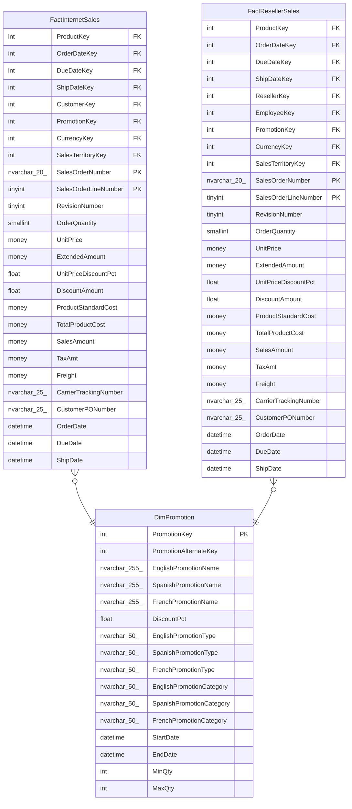

# DimPromotion

## Description

## Columns

| Name | Type | Default | Nullable | Children | Parents | Comment |
| ---- | ---- | ------- | -------- | -------- | ------- | ------- |
| PromotionKey | int |  | false | [FactInternetSales](FactInternetSales.md) [FactResellerSales](FactResellerSales.md) |  |  |
| PromotionAlternateKey | int |  | true |  |  |  |
| EnglishPromotionName | nvarchar(255) |  | true |  |  |  |
| SpanishPromotionName | nvarchar(255) |  | true |  |  |  |
| FrenchPromotionName | nvarchar(255) |  | true |  |  |  |
| DiscountPct | float |  | true |  |  |  |
| EnglishPromotionType | nvarchar(50) |  | true |  |  |  |
| SpanishPromotionType | nvarchar(50) |  | true |  |  |  |
| FrenchPromotionType | nvarchar(50) |  | true |  |  |  |
| EnglishPromotionCategory | nvarchar(50) |  | true |  |  |  |
| SpanishPromotionCategory | nvarchar(50) |  | true |  |  |  |
| FrenchPromotionCategory | nvarchar(50) |  | true |  |  |  |
| StartDate | datetime |  | false |  |  |  |
| EndDate | datetime |  | true |  |  |  |
| MinQty | int |  | true |  |  |  |
| MaxQty | int |  | true |  |  |  |

## Constraints

| Name | Type | Definition |
| ---- | ---- | ---------- |
| PK_DimPromotion_PromotionKey | PRIMARY KEY | CLUSTERED, unique, part of a PRIMARY KEY constraint, [ PromotionKey ] |
| AK_DimPromotion_PromotionAlternateKey | UNIQUE | NONCLUSTERED, unique, part of a UNIQUE constraint, [ PromotionAlternateKey ] |

## Indexes

| Name | Definition |
| ---- | ---------- |
| PK_DimPromotion_PromotionKey | CLUSTERED, unique, part of a PRIMARY KEY constraint, [ PromotionKey ] |
| AK_DimPromotion_PromotionAlternateKey | NONCLUSTERED, unique, part of a UNIQUE constraint, [ PromotionAlternateKey ] |

## Relations

---

> Generated by [tbls](https://github.com/k1LoW/tbls)
