# DimReseller

## Description

## Columns

| Name | Type | Default | Nullable | Children | Parents | Comment |
| ---- | ---- | ------- | -------- | -------- | ------- | ------- |
| ResellerKey | int |  | false | [FactResellerSales](FactResellerSales.md) |  |  |
| GeographyKey | int |  | true |  | [DimGeography](DimGeography.md) |  |
| ResellerAlternateKey | nvarchar(15) |  | true |  |  |  |
| Phone | nvarchar(25) |  | true |  |  |  |
| BusinessType | varchar(20) |  | false |  |  |  |
| ResellerName | nvarchar(50) |  | false |  |  |  |
| NumberEmployees | int |  | true |  |  |  |
| OrderFrequency | char |  | true |  |  |  |
| OrderMonth | tinyint |  | true |  |  |  |
| FirstOrderYear | int |  | true |  |  |  |
| LastOrderYear | int |  | true |  |  |  |
| ProductLine | nvarchar(50) |  | true |  |  |  |
| AddressLine1 | nvarchar(60) |  | true |  |  |  |
| AddressLine2 | nvarchar(60) |  | true |  |  |  |
| AnnualSales | money |  | true |  |  |  |
| BankName | nvarchar(50) |  | true |  |  |  |
| MinPaymentType | tinyint |  | true |  |  |  |
| MinPaymentAmount | money |  | true |  |  |  |
| AnnualRevenue | money |  | true |  |  |  |
| YearOpened | int |  | true |  |  |  |

## Constraints

| Name | Type | Definition |
| ---- | ---- | ---------- |
| PK_DimReseller_ResellerKey | PRIMARY KEY | CLUSTERED, unique, part of a PRIMARY KEY constraint, [ ResellerKey ] |
| AK_DimReseller_ResellerAlternateKey | UNIQUE | NONCLUSTERED, unique, part of a UNIQUE constraint, [ ResellerAlternateKey ] |
| FK_DimReseller_DimGeography | FOREIGN KEY | FOREIGN KEY(GeographyKey) REFERENCES DimGeography(GeographyKey) ON UPDATE NO_ACTION ON DELETE NO_ACTION |

## Indexes

| Name | Definition |
| ---- | ---------- |
| PK_DimReseller_ResellerKey | CLUSTERED, unique, part of a PRIMARY KEY constraint, [ ResellerKey ] |
| AK_DimReseller_ResellerAlternateKey | NONCLUSTERED, unique, part of a UNIQUE constraint, [ ResellerAlternateKey ] |

## Relations

```mermaid
erDiagram

"FactResellerSales" }o--|| "DimReseller" : ""
"DimReseller" }o--o| "DimGeography" : ""

"DimReseller" {
  int ResellerKey PK
  int GeographyKey FK
  nvarchar_15_ ResellerAlternateKey
  nvarchar_25_ Phone
  varchar_20_ BusinessType
  nvarchar_50_ ResellerName
  int NumberEmployees
  char OrderFrequency
  tinyint OrderMonth
  int FirstOrderYear
  int LastOrderYear
  nvarchar_50_ ProductLine
  nvarchar_60_ AddressLine1
  nvarchar_60_ AddressLine2
  money AnnualSales
  nvarchar_50_ BankName
  tinyint MinPaymentType
  money MinPaymentAmount
  money AnnualRevenue
  int YearOpened
}
"FactResellerSales" {
  int ProductKey FK
  int OrderDateKey FK
  int DueDateKey FK
  int ShipDateKey FK
  int ResellerKey FK
  int EmployeeKey FK
  int PromotionKey FK
  int CurrencyKey FK
  int SalesTerritoryKey FK
  nvarchar_20_ SalesOrderNumber PK
  tinyint SalesOrderLineNumber PK
  tinyint RevisionNumber
  smallint OrderQuantity
  money UnitPrice
  money ExtendedAmount
  float UnitPriceDiscountPct
  float DiscountAmount
  money ProductStandardCost
  money TotalProductCost
  money SalesAmount
  money TaxAmt
  money Freight
  nvarchar_25_ CarrierTrackingNumber
  nvarchar_25_ CustomerPONumber
  datetime OrderDate
  datetime DueDate
  datetime ShipDate
}
"DimGeography" {
  int GeographyKey PK
  nvarchar_30_ City
  nvarchar_3_ StateProvinceCode
  nvarchar_50_ StateProvinceName
  nvarchar_3_ CountryRegionCode
  nvarchar_50_ EnglishCountryRegionName
  nvarchar_50_ SpanishCountryRegionName
  nvarchar_50_ FrenchCountryRegionName
  nvarchar_15_ PostalCode
  int SalesTerritoryKey FK
  nvarchar_15_ IpAddressLocator
}
```

---

> Generated by [tbls](https://github.com/k1LoW/tbls)
