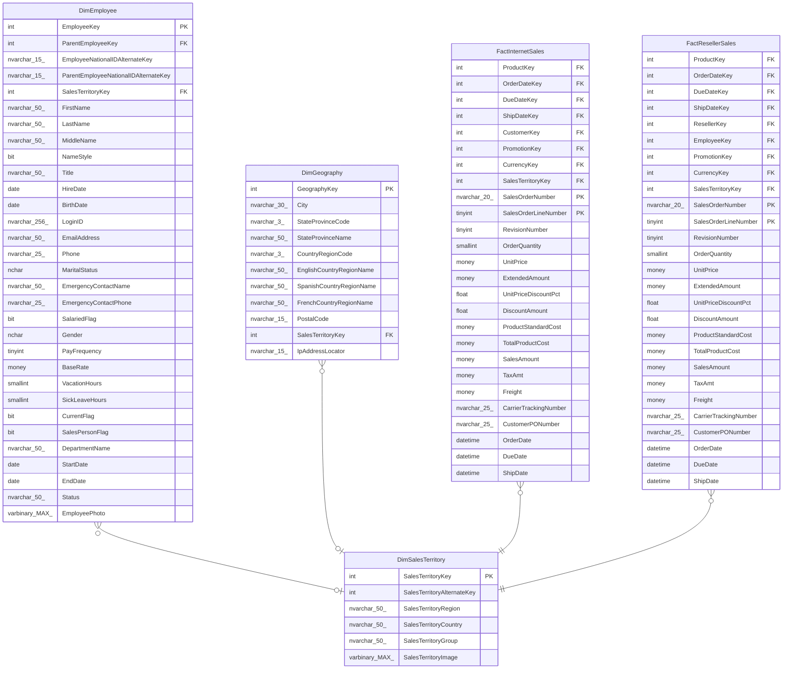

# DimSalesTerritory

## Description

## Columns

| Name | Type | Default | Nullable | Children | Parents | Comment |
| ---- | ---- | ------- | -------- | -------- | ------- | ------- |
| SalesTerritoryKey | int |  | false | [DimEmployee](DimEmployee.md) [DimGeography](DimGeography.md) [FactInternetSales](FactInternetSales.md) [FactResellerSales](FactResellerSales.md) |  |  |
| SalesTerritoryAlternateKey | int |  | true |  |  |  |
| SalesTerritoryRegion | nvarchar(50) |  | false |  |  |  |
| SalesTerritoryCountry | nvarchar(50) |  | false |  |  |  |
| SalesTerritoryGroup | nvarchar(50) |  | true |  |  |  |
| SalesTerritoryImage | varbinary(MAX) |  | true |  |  |  |

## Constraints

| Name | Type | Definition |
| ---- | ---- | ---------- |
| PK_DimSalesTerritory_SalesTerritoryKey | PRIMARY KEY | CLUSTERED, unique, part of a PRIMARY KEY constraint, [ SalesTerritoryKey ] |
| AK_DimSalesTerritory_SalesTerritoryAlternateKey | UNIQUE | NONCLUSTERED, unique, part of a UNIQUE constraint, [ SalesTerritoryAlternateKey ] |

## Indexes

| Name | Definition |
| ---- | ---------- |
| PK_DimSalesTerritory_SalesTerritoryKey | CLUSTERED, unique, part of a PRIMARY KEY constraint, [ SalesTerritoryKey ] |
| AK_DimSalesTerritory_SalesTerritoryAlternateKey | NONCLUSTERED, unique, part of a UNIQUE constraint, [ SalesTerritoryAlternateKey ] |

## Relations

---

> Generated by [tbls](https://github.com/k1LoW/tbls)
