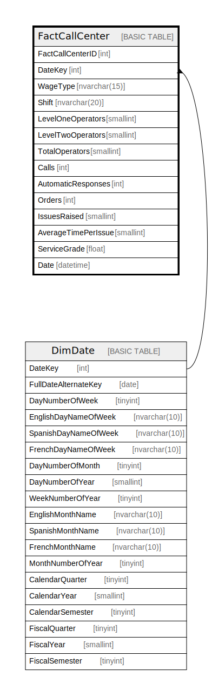

# FactCallCenter

## Description

## Columns

| Name | Type | Default | Nullable | Children | Parents | Comment |
| ---- | ---- | ------- | -------- | -------- | ------- | ------- |
| FactCallCenterID | int |  | false |  |  |  |
| DateKey | int |  | false |  | [DimDate](DimDate.md) |  |
| WageType | nvarchar(15) |  | false |  |  |  |
| Shift | nvarchar(20) |  | false |  |  |  |
| LevelOneOperators | smallint |  | false |  |  |  |
| LevelTwoOperators | smallint |  | false |  |  |  |
| TotalOperators | smallint |  | false |  |  |  |
| Calls | int |  | false |  |  |  |
| AutomaticResponses | int |  | false |  |  |  |
| Orders | int |  | false |  |  |  |
| IssuesRaised | smallint |  | false |  |  |  |
| AverageTimePerIssue | smallint |  | false |  |  |  |
| ServiceGrade | float |  | false |  |  |  |
| Date | datetime |  | true |  |  |  |

## Constraints

| Name | Type | Definition |
| ---- | ---- | ---------- |
| PK_FactCallCenter_FactCallCenterID | PRIMARY KEY | CLUSTERED, unique, part of a PRIMARY KEY constraint, [ FactCallCenterID ] |
| AK_FactCallCenter_DateKey_Shift | UNIQUE | NONCLUSTERED, unique, part of a UNIQUE constraint, [ DateKey, Shift ] |
| FK_FactCallCenter_DimDate | FOREIGN KEY | FOREIGN KEY(DateKey) REFERENCES DimDate(DateKey) ON UPDATE NO_ACTION ON DELETE NO_ACTION |

## Indexes

| Name | Definition |
| ---- | ---------- |
| PK_FactCallCenter_FactCallCenterID | CLUSTERED, unique, part of a PRIMARY KEY constraint, [ FactCallCenterID ] |
| AK_FactCallCenter_DateKey_Shift | NONCLUSTERED, unique, part of a UNIQUE constraint, [ DateKey, Shift ] |

## Relations

---

> Generated by [tbls](https://github.com/k1LoW/tbls)
