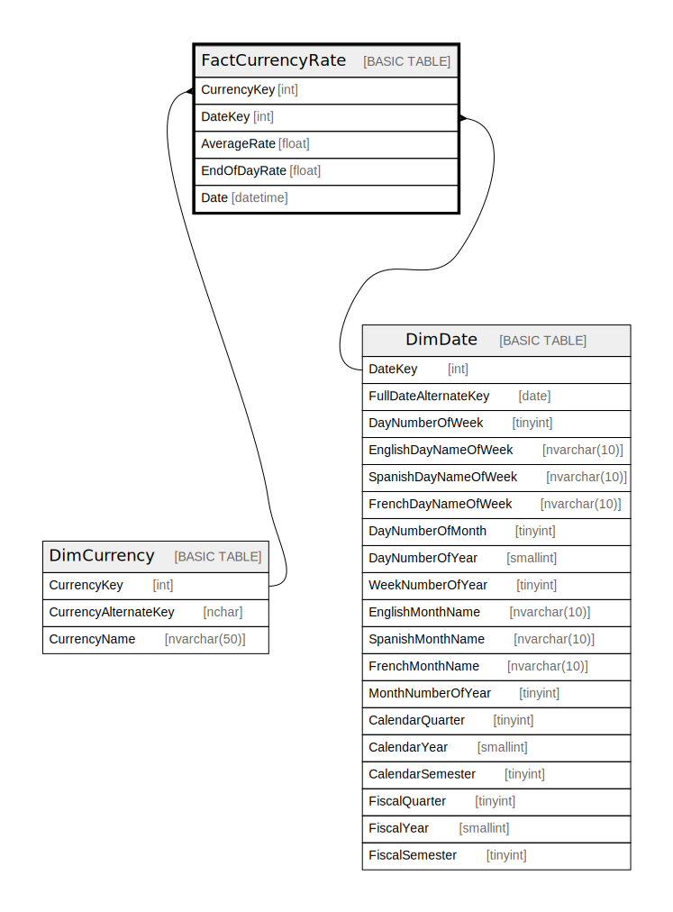

# FactCurrencyRate

## Description

## Columns

| Name | Type | Default | Nullable | Children | Parents | Comment |
| ---- | ---- | ------- | -------- | -------- | ------- | ------- |
| CurrencyKey | int |  | false |  | [DimCurrency](DimCurrency.md) |  |
| DateKey | int |  | false |  | [DimDate](DimDate.md) |  |
| AverageRate | float |  | false |  |  |  |
| EndOfDayRate | float |  | false |  |  |  |
| Date | datetime |  | true |  |  |  |

## Constraints

| Name | Type | Definition |
| ---- | ---- | ---------- |
| PK_FactCurrencyRate_CurrencyKey_DateKey | PRIMARY KEY | CLUSTERED, unique, part of a PRIMARY KEY constraint, [ CurrencyKey, DateKey ] |
| FK_FactCurrencyRate_DimCurrency | FOREIGN KEY | FOREIGN KEY(CurrencyKey) REFERENCES DimCurrency(CurrencyKey) ON UPDATE NO_ACTION ON DELETE NO_ACTION |
| FK_FactCurrencyRate_DimDate | FOREIGN KEY | FOREIGN KEY(DateKey) REFERENCES DimDate(DateKey) ON UPDATE NO_ACTION ON DELETE NO_ACTION |

## Indexes

| Name | Definition |
| ---- | ---------- |
| PK_FactCurrencyRate_CurrencyKey_DateKey | CLUSTERED, unique, part of a PRIMARY KEY constraint, [ CurrencyKey, DateKey ] |

## Relations

---

> Generated by [tbls](https://github.com/k1LoW/tbls)
