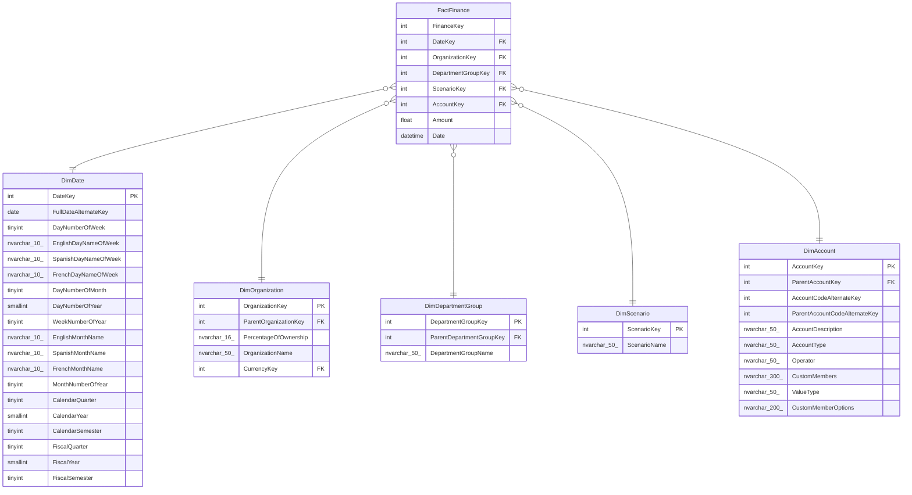

# FactFinance

## Description

## Columns

| Name | Type | Default | Nullable | Children | Parents | Comment |
| ---- | ---- | ------- | -------- | -------- | ------- | ------- |
| FinanceKey | int |  | false |  |  |  |
| DateKey | int |  | false |  | [DimDate](DimDate.md) |  |
| OrganizationKey | int |  | false |  | [DimOrganization](DimOrganization.md) |  |
| DepartmentGroupKey | int |  | false |  | [DimDepartmentGroup](DimDepartmentGroup.md) |  |
| ScenarioKey | int |  | false |  | [DimScenario](DimScenario.md) |  |
| AccountKey | int |  | false |  | [DimAccount](DimAccount.md) |  |
| Amount | float |  | false |  |  |  |
| Date | datetime |  | true |  |  |  |

## Constraints

| Name | Type | Definition |
| ---- | ---- | ---------- |
| FK_FactFinance_DimAccount | FOREIGN KEY | FOREIGN KEY(AccountKey) REFERENCES DimAccount(AccountKey) ON UPDATE NO_ACTION ON DELETE NO_ACTION |
| FK_FactFinance_DimDate | FOREIGN KEY | FOREIGN KEY(DateKey) REFERENCES DimDate(DateKey) ON UPDATE NO_ACTION ON DELETE NO_ACTION |
| FK_FactFinance_DimDepartmentGroup | FOREIGN KEY | FOREIGN KEY(DepartmentGroupKey) REFERENCES DimDepartmentGroup(DepartmentGroupKey) ON UPDATE NO_ACTION ON DELETE NO_ACTION |
| FK_FactFinance_DimOrganization | FOREIGN KEY | FOREIGN KEY(OrganizationKey) REFERENCES DimOrganization(OrganizationKey) ON UPDATE NO_ACTION ON DELETE NO_ACTION |
| FK_FactFinance_DimScenario | FOREIGN KEY | FOREIGN KEY(ScenarioKey) REFERENCES DimScenario(ScenarioKey) ON UPDATE NO_ACTION ON DELETE NO_ACTION |

## Relations

---

> Generated by [tbls](https://github.com/k1LoW/tbls)
