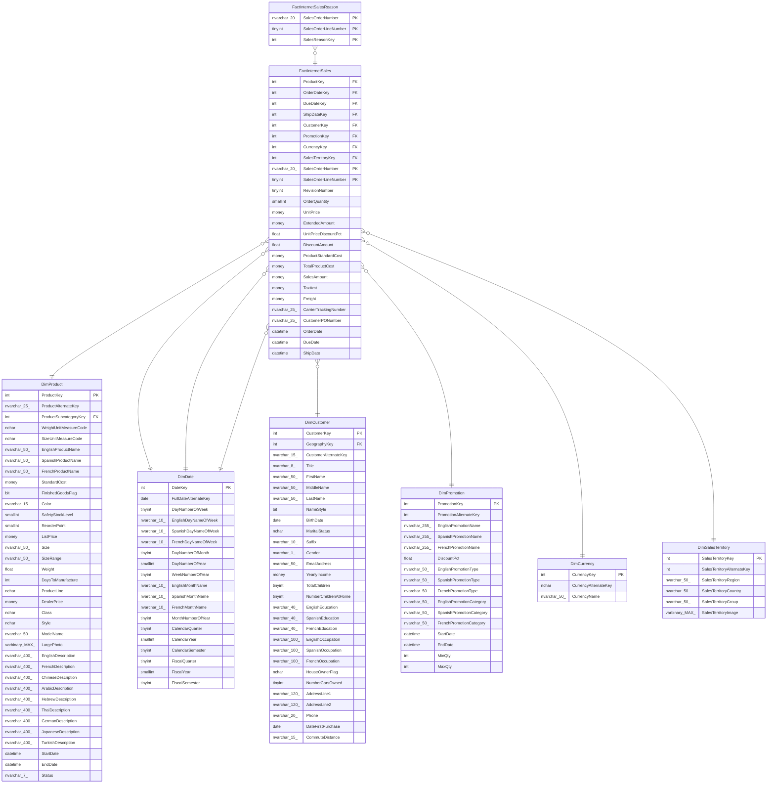

# FactInternetSales

## Description

## Columns

| Name | Type | Default | Nullable | Children | Parents | Comment |
| ---- | ---- | ------- | -------- | -------- | ------- | ------- |
| ProductKey | int |  | false |  | [DimProduct](DimProduct.md) |  |
| OrderDateKey | int |  | false |  | [DimDate](DimDate.md) |  |
| DueDateKey | int |  | false |  | [DimDate](DimDate.md) |  |
| ShipDateKey | int |  | false |  | [DimDate](DimDate.md) |  |
| CustomerKey | int |  | false |  | [DimCustomer](DimCustomer.md) |  |
| PromotionKey | int |  | false |  | [DimPromotion](DimPromotion.md) |  |
| CurrencyKey | int |  | false |  | [DimCurrency](DimCurrency.md) |  |
| SalesTerritoryKey | int |  | false |  | [DimSalesTerritory](DimSalesTerritory.md) |  |
| SalesOrderNumber | nvarchar(20) |  | false | [FactInternetSalesReason](FactInternetSalesReason.md) |  |  |
| SalesOrderLineNumber | tinyint |  | false | [FactInternetSalesReason](FactInternetSalesReason.md) |  |  |
| RevisionNumber | tinyint |  | false |  |  |  |
| OrderQuantity | smallint |  | false |  |  |  |
| UnitPrice | money |  | false |  |  |  |
| ExtendedAmount | money |  | false |  |  |  |
| UnitPriceDiscountPct | float |  | false |  |  |  |
| DiscountAmount | float |  | false |  |  |  |
| ProductStandardCost | money |  | false |  |  |  |
| TotalProductCost | money |  | false |  |  |  |
| SalesAmount | money |  | false |  |  |  |
| TaxAmt | money |  | false |  |  |  |
| Freight | money |  | false |  |  |  |
| CarrierTrackingNumber | nvarchar(25) |  | true |  |  |  |
| CustomerPONumber | nvarchar(25) |  | true |  |  |  |
| OrderDate | datetime |  | true |  |  |  |
| DueDate | datetime |  | true |  |  |  |
| ShipDate | datetime |  | true |  |  |  |

## Constraints

| Name | Type | Definition |
| ---- | ---- | ---------- |
| PK_FactInternetSales_SalesOrderNumber_SalesOrderLineNumber | PRIMARY KEY | CLUSTERED, unique, part of a PRIMARY KEY constraint, [ SalesOrderNumber, SalesOrderLineNumber ] |
| FK_FactInternetSales_DimCurrency | FOREIGN KEY | FOREIGN KEY(CurrencyKey) REFERENCES DimCurrency(CurrencyKey) ON UPDATE NO_ACTION ON DELETE NO_ACTION |
| FK_FactInternetSales_DimCustomer | FOREIGN KEY | FOREIGN KEY(CustomerKey) REFERENCES DimCustomer(CustomerKey) ON UPDATE NO_ACTION ON DELETE NO_ACTION |
| FK_FactInternetSales_DimDate | FOREIGN KEY | FOREIGN KEY(OrderDateKey) REFERENCES DimDate(DateKey) ON UPDATE NO_ACTION ON DELETE NO_ACTION |
| FK_FactInternetSales_DimDate1 | FOREIGN KEY | FOREIGN KEY(DueDateKey) REFERENCES DimDate(DateKey) ON UPDATE NO_ACTION ON DELETE NO_ACTION |
| FK_FactInternetSales_DimDate2 | FOREIGN KEY | FOREIGN KEY(ShipDateKey) REFERENCES DimDate(DateKey) ON UPDATE NO_ACTION ON DELETE NO_ACTION |
| FK_FactInternetSales_DimProduct | FOREIGN KEY | FOREIGN KEY(ProductKey) REFERENCES DimProduct(ProductKey) ON UPDATE NO_ACTION ON DELETE NO_ACTION |
| FK_FactInternetSales_DimPromotion | FOREIGN KEY | FOREIGN KEY(PromotionKey) REFERENCES DimPromotion(PromotionKey) ON UPDATE NO_ACTION ON DELETE NO_ACTION |
| FK_FactInternetSales_DimSalesTerritory | FOREIGN KEY | FOREIGN KEY(SalesTerritoryKey) REFERENCES DimSalesTerritory(SalesTerritoryKey) ON UPDATE NO_ACTION ON DELETE NO_ACTION |

## Indexes

| Name | Definition |
| ---- | ---------- |
| PK_FactInternetSales_SalesOrderNumber_SalesOrderLineNumber | CLUSTERED, unique, part of a PRIMARY KEY constraint, [ SalesOrderNumber, SalesOrderLineNumber ] |

## Relations

---

> Generated by [tbls](https://github.com/k1LoW/tbls)
