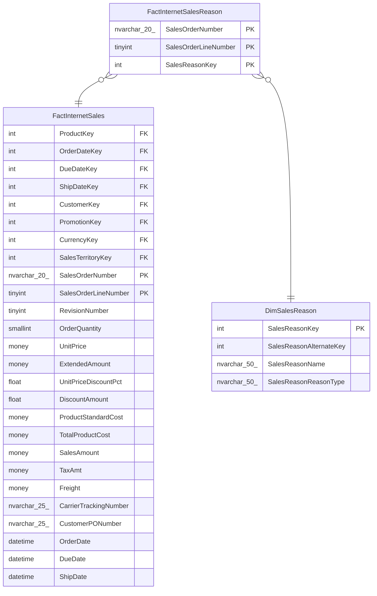

# FactInternetSalesReason

## Description

## Columns

| Name | Type | Default | Nullable | Children | Parents | Comment |
| ---- | ---- | ------- | -------- | -------- | ------- | ------- |
| SalesOrderNumber | nvarchar(20) |  | false |  | [FactInternetSales](FactInternetSales.md) |  |
| SalesOrderLineNumber | tinyint |  | false |  | [FactInternetSales](FactInternetSales.md) |  |
| SalesReasonKey | int |  | false |  | [DimSalesReason](DimSalesReason.md) |  |

## Constraints

| Name | Type | Definition |
| ---- | ---- | ---------- |
| PK_FactInternetSalesReason_SalesOrderNumber_SalesOrderLineNumber_SalesReasonKey | PRIMARY KEY | CLUSTERED, unique, part of a PRIMARY KEY constraint, [ SalesOrderNumber, SalesOrderLineNumber, SalesReasonKey ] |
| FK_FactInternetSalesReason_DimSalesReason | FOREIGN KEY | FOREIGN KEY(SalesReasonKey) REFERENCES DimSalesReason(SalesReasonKey) ON UPDATE NO_ACTION ON DELETE NO_ACTION |
| FK_FactInternetSalesReason_FactInternetSales | FOREIGN KEY | FOREIGN KEY(SalesOrderNumber, SalesOrderLineNumber) REFERENCES FactInternetSales(SalesOrderNumber, SalesOrderLineNumber) ON UPDATE NO_ACTION ON DELETE NO_ACTION |

## Indexes

| Name | Definition |
| ---- | ---------- |
| PK_FactInternetSalesReason_SalesOrderNumber_SalesOrderLineNumber_SalesReasonKey | CLUSTERED, unique, part of a PRIMARY KEY constraint, [ SalesOrderNumber, SalesOrderLineNumber, SalesReasonKey ] |

## Relations

---

> Generated by [tbls](https://github.com/k1LoW/tbls)
