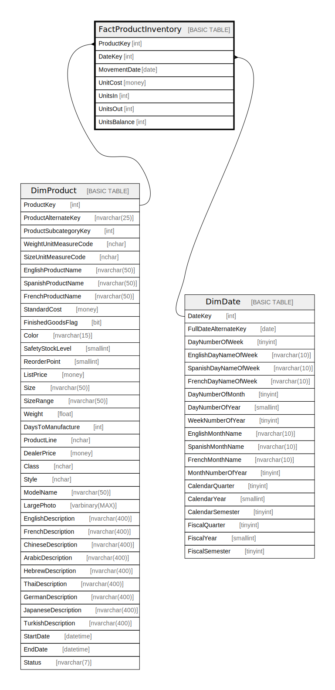

# FactProductInventory

## Description

## Columns

| Name | Type | Default | Nullable | Children | Parents | Comment |
| ---- | ---- | ------- | -------- | -------- | ------- | ------- |
| ProductKey | int |  | false |  | [DimProduct](DimProduct.md) |  |
| DateKey | int |  | false |  | [DimDate](DimDate.md) |  |
| MovementDate | date |  | false |  |  |  |
| UnitCost | money |  | false |  |  |  |
| UnitsIn | int |  | false |  |  |  |
| UnitsOut | int |  | false |  |  |  |
| UnitsBalance | int |  | false |  |  |  |

## Constraints

| Name | Type | Definition |
| ---- | ---- | ---------- |
| PK_FactProductInventory | PRIMARY KEY | CLUSTERED, unique, part of a PRIMARY KEY constraint, [ ProductKey, DateKey ] |
| FK_FactProductInventory_DimDate | FOREIGN KEY | FOREIGN KEY(DateKey) REFERENCES DimDate(DateKey) ON UPDATE NO_ACTION ON DELETE NO_ACTION |
| FK_FactProductInventory_DimProduct | FOREIGN KEY | FOREIGN KEY(ProductKey) REFERENCES DimProduct(ProductKey) ON UPDATE NO_ACTION ON DELETE NO_ACTION |

## Indexes

| Name | Definition |
| ---- | ---------- |
| PK_FactProductInventory | CLUSTERED, unique, part of a PRIMARY KEY constraint, [ ProductKey, DateKey ] |

## Relations

---

> Generated by [tbls](https://github.com/k1LoW/tbls)
