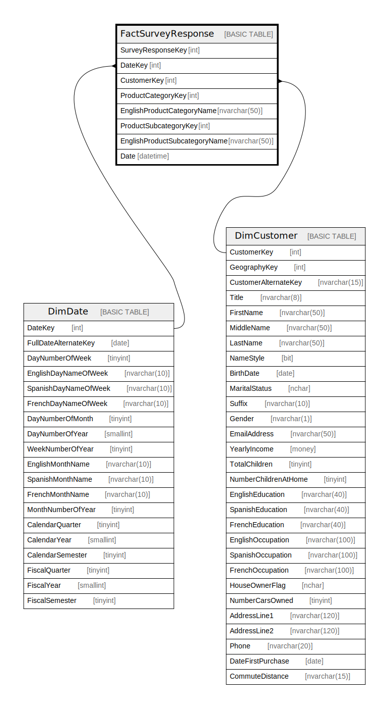

# FactSurveyResponse

## Description

## Columns

| Name | Type | Default | Nullable | Children | Parents | Comment |
| ---- | ---- | ------- | -------- | -------- | ------- | ------- |
| SurveyResponseKey | int |  | false |  |  |  |
| DateKey | int |  | false |  | [DimDate](DimDate.md) |  |
| CustomerKey | int |  | false |  | [DimCustomer](DimCustomer.md) |  |
| ProductCategoryKey | int |  | false |  |  |  |
| EnglishProductCategoryName | nvarchar(50) |  | false |  |  |  |
| ProductSubcategoryKey | int |  | false |  |  |  |
| EnglishProductSubcategoryName | nvarchar(50) |  | false |  |  |  |
| Date | datetime |  | true |  |  |  |

## Constraints

| Name | Type | Definition |
| ---- | ---- | ---------- |
| PK_FactSurveyResponse_SurveyResponseKey | PRIMARY KEY | CLUSTERED, unique, part of a PRIMARY KEY constraint, [ SurveyResponseKey ] |
| FK_FactSurveyResponse_CustomerKey | FOREIGN KEY | FOREIGN KEY(CustomerKey) REFERENCES DimCustomer(CustomerKey) ON UPDATE NO_ACTION ON DELETE NO_ACTION |
| FK_FactSurveyResponse_DateKey | FOREIGN KEY | FOREIGN KEY(DateKey) REFERENCES DimDate(DateKey) ON UPDATE NO_ACTION ON DELETE NO_ACTION |

## Indexes

| Name | Definition |
| ---- | ---------- |
| PK_FactSurveyResponse_SurveyResponseKey | CLUSTERED, unique, part of a PRIMARY KEY constraint, [ SurveyResponseKey ] |

## Relations

---

> Generated by [tbls](https://github.com/k1LoW/tbls)
