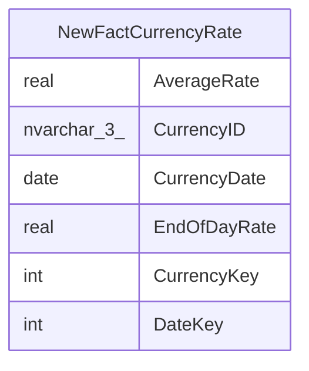

# NewFactCurrencyRate

## Description

## Columns

| Name | Type | Default | Nullable | Children | Parents | Comment |
| ---- | ---- | ------- | -------- | -------- | ------- | ------- |
| AverageRate | real |  | true |  |  |  |
| CurrencyID | nvarchar(3) |  | true |  |  |  |
| CurrencyDate | date |  | true |  |  |  |
| EndOfDayRate | real |  | true |  |  |  |
| CurrencyKey | int |  | true |  |  |  |
| DateKey | int |  | true |  |  |  |

## Relations

---

> Generated by [tbls](https://github.com/k1LoW/tbls)
