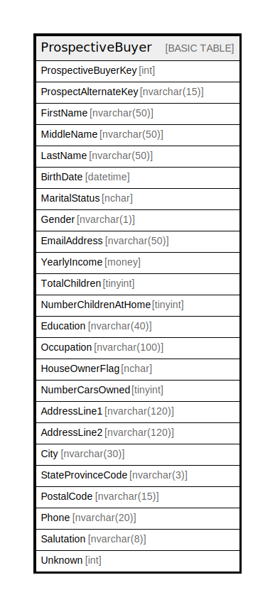

# ProspectiveBuyer

## Description

## Columns

| Name | Type | Default | Nullable | Children | Parents | Comment |
| ---- | ---- | ------- | -------- | -------- | ------- | ------- |
| ProspectiveBuyerKey | int |  | false |  |  |  |
| ProspectAlternateKey | nvarchar(15) |  | true |  |  |  |
| FirstName | nvarchar(50) |  | true |  |  |  |
| MiddleName | nvarchar(50) |  | true |  |  |  |
| LastName | nvarchar(50) |  | true |  |  |  |
| BirthDate | datetime |  | true |  |  |  |
| MaritalStatus | nchar |  | true |  |  |  |
| Gender | nvarchar(1) |  | true |  |  |  |
| EmailAddress | nvarchar(50) |  | true |  |  |  |
| YearlyIncome | money |  | true |  |  |  |
| TotalChildren | tinyint |  | true |  |  |  |
| NumberChildrenAtHome | tinyint |  | true |  |  |  |
| Education | nvarchar(40) |  | true |  |  |  |
| Occupation | nvarchar(100) |  | true |  |  |  |
| HouseOwnerFlag | nchar |  | true |  |  |  |
| NumberCarsOwned | tinyint |  | true |  |  |  |
| AddressLine1 | nvarchar(120) |  | true |  |  |  |
| AddressLine2 | nvarchar(120) |  | true |  |  |  |
| City | nvarchar(30) |  | true |  |  |  |
| StateProvinceCode | nvarchar(3) |  | true |  |  |  |
| PostalCode | nvarchar(15) |  | true |  |  |  |
| Phone | nvarchar(20) |  | true |  |  |  |
| Salutation | nvarchar(8) |  | true |  |  |  |
| Unknown | int |  | true |  |  |  |

## Constraints

| Name | Type | Definition |
| ---- | ---- | ---------- |
| PK_ProspectiveBuyer_ProspectiveBuyerKey | PRIMARY KEY | CLUSTERED, unique, part of a PRIMARY KEY constraint, [ ProspectiveBuyerKey ] |

## Indexes

| Name | Definition |
| ---- | ---------- |
| PK_ProspectiveBuyer_ProspectiveBuyerKey | CLUSTERED, unique, part of a PRIMARY KEY constraint, [ ProspectiveBuyerKey ] |

## Relations

---

> Generated by [tbls](https://github.com/k1LoW/tbls)
