# AdventureWorksDW2022

## Tables

| Name | Columns | Comment | Type |
| ---- | ------- | ------- | ---- |
| [vDMPrep](vDMPrep.md) | 13 |  | VIEW |
| [vTimeSeries](vTimeSeries.md) | 7 |  | VIEW |
| [vTargetMail](vTargetMail.md) | 32 |  | VIEW |
| [vAssocSeqOrders](vAssocSeqOrders.md) | 4 |  | VIEW |
| [vAssocSeqLineItems](vAssocSeqLineItems.md) | 3 |  | VIEW |
| [DatabaseLog](DatabaseLog.md) | 8 |  | BASIC TABLE |
| [AdventureWorksDWBuildVersion](AdventureWorksDWBuildVersion.md) | 2 |  | BASIC TABLE |
| [DimAccount](DimAccount.md) | 10 |  | BASIC TABLE |
| [DimCurrency](DimCurrency.md) | 3 |  | BASIC TABLE |
| [DimCustomer](DimCustomer.md) | 29 |  | BASIC TABLE |
| [DimDate](DimDate.md) | 19 |  | BASIC TABLE |
| [DimDepartmentGroup](DimDepartmentGroup.md) | 3 |  | BASIC TABLE |
| [DimEmployee](DimEmployee.md) | 31 |  | BASIC TABLE |
| [DimGeography](DimGeography.md) | 11 |  | BASIC TABLE |
| [DimOrganization](DimOrganization.md) | 5 |  | BASIC TABLE |
| [DimProduct](DimProduct.md) | 36 |  | BASIC TABLE |
| [DimProductCategory](DimProductCategory.md) | 5 |  | BASIC TABLE |
| [DimProductSubcategory](DimProductSubcategory.md) | 6 |  | BASIC TABLE |
| [DimPromotion](DimPromotion.md) | 16 |  | BASIC TABLE |
| [DimReseller](DimReseller.md) | 20 |  | BASIC TABLE |
| [DimSalesReason](DimSalesReason.md) | 4 |  | BASIC TABLE |
| [DimSalesTerritory](DimSalesTerritory.md) | 6 |  | BASIC TABLE |
| [DimScenario](DimScenario.md) | 2 |  | BASIC TABLE |
| [FactAdditionalInternationalProductDescription](FactAdditionalInternationalProductDescription.md) | 3 |  | BASIC TABLE |
| [FactCallCenter](FactCallCenter.md) | 14 |  | BASIC TABLE |
| [FactCurrencyRate](FactCurrencyRate.md) | 5 |  | BASIC TABLE |
| [FactFinance](FactFinance.md) | 8 |  | BASIC TABLE |
| [FactInternetSales](FactInternetSales.md) | 26 |  | BASIC TABLE |
| [FactInternetSalesReason](FactInternetSalesReason.md) | 3 |  | BASIC TABLE |
| [FactProductInventory](FactProductInventory.md) | 7 |  | BASIC TABLE |
| [FactResellerSales](FactResellerSales.md) | 27 |  | BASIC TABLE |
| [FactSalesQuota](FactSalesQuota.md) | 7 |  | BASIC TABLE |
| [FactSurveyResponse](FactSurveyResponse.md) | 8 |  | BASIC TABLE |
| [NewFactCurrencyRate](NewFactCurrencyRate.md) | 6 |  | BASIC TABLE |
| [ProspectiveBuyer](ProspectiveBuyer.md) | 24 |  | BASIC TABLE |
| [sysdiagrams](sysdiagrams.md) | 5 |  | BASIC TABLE |

## Stored procedures and functions

| Name | ReturnType | Arguments | Type |
| ---- | ------- | ------- | ---- |
| dbo.udfBuildISO8601Date | datetime | @year int, @month int, @day int | SQL scalar function |
| dbo.udfMinimumDate | datetime | @x datetime, @y datetime | SQL scalar function |
| dbo.udfTwoDigitZeroFill | char | @number int | SQL scalar function |

## Relations

```mermaid
erDiagram

"DimAccount" }o--o| "DimAccount" : ""
"DimCustomer" }o--o| "DimGeography" : ""
"DimDepartmentGroup" }o--o| "DimDepartmentGroup" : ""
"DimEmployee" }o--o| "DimEmployee" : ""
"DimEmployee" }o--o| "DimSalesTerritory" : ""
"DimGeography" }o--o| "DimSalesTerritory" : ""
"DimOrganization" }o--o| "DimCurrency" : ""
"DimOrganization" }o--o| "DimOrganization" : ""
"DimProduct" }o--o| "DimProductSubcategory" : ""
"DimProductSubcategory" }o--o| "DimProductCategory" : ""
"DimReseller" }o--o| "DimGeography" : ""
"FactCallCenter" }o--|| "DimDate" : ""
"FactCurrencyRate" }o--|| "DimCurrency" : ""
"FactCurrencyRate" }o--|| "DimDate" : ""
"FactFinance" }o--|| "DimAccount" : ""
"FactFinance" }o--|| "DimDate" : ""
"FactFinance" }o--|| "DimDepartmentGroup" : ""
"FactFinance" }o--|| "DimOrganization" : ""
"FactFinance" }o--|| "DimScenario" : ""
"FactInternetSales" }o--|| "DimCurrency" : ""
"FactInternetSales" }o--|| "DimCustomer" : ""
"FactInternetSales" }o--|| "DimDate" : ""
"FactInternetSales" }o--|| "DimDate" : ""
"FactInternetSales" }o--|| "DimDate" : ""
"FactInternetSales" }o--|| "DimProduct" : ""
"FactInternetSales" }o--|| "DimPromotion" : ""
"FactInternetSales" }o--|| "DimSalesTerritory" : ""
"FactInternetSalesReason" }o--|| "DimSalesReason" : ""
"FactInternetSalesReason" }o--|| "FactInternetSales" : ""
"FactProductInventory" }o--|| "DimDate" : ""
"FactProductInventory" }o--|| "DimProduct" : ""
"FactResellerSales" }o--|| "DimCurrency" : ""
"FactResellerSales" }o--|| "DimDate" : ""
"FactResellerSales" }o--|| "DimDate" : ""
"FactResellerSales" }o--|| "DimDate" : ""
"FactResellerSales" }o--|| "DimEmployee" : ""
"FactResellerSales" }o--|| "DimProduct" : ""
"FactResellerSales" }o--|| "DimPromotion" : ""
"FactResellerSales" }o--|| "DimReseller" : ""
"FactResellerSales" }o--|| "DimSalesTerritory" : ""
"FactSalesQuota" }o--|| "DimDate" : ""
"FactSalesQuota" }o--|| "DimEmployee" : ""
"FactSurveyResponse" }o--|| "DimCustomer" : ""
"FactSurveyResponse" }o--|| "DimDate" : ""

"vDMPrep" {
  nvarchar_50_ EnglishProductCategoryName
  nvarchar_50_ Model
  int CustomerKey
  nvarchar_50_ Region
  int Age
  varchar_8_ IncomeGroup
  smallint CalendarYear
  smallint FiscalYear
  tinyint Month
  nvarchar_20_ OrderNumber
  tinyint LineNumber
  smallint Quantity
  money Amount
}
"vTimeSeries" {
  nvarchar_56_ ModelRegion
  int TimeIndex
  int Quantity
  money Amount
  smallint CalendarYear
  tinyint Month
  datetime ReportingDate
}
"vTargetMail" {
  int CustomerKey
  int GeographyKey
  nvarchar_15_ CustomerAlternateKey
  nvarchar_8_ Title
  nvarchar_50_ FirstName
  nvarchar_50_ MiddleName
  nvarchar_50_ LastName
  bit NameStyle
  date BirthDate
  nchar MaritalStatus
  nvarchar_10_ Suffix
  nvarchar_1_ Gender
  nvarchar_50_ EmailAddress
  money YearlyIncome
  tinyint TotalChildren
  tinyint NumberChildrenAtHome
  nvarchar_40_ EnglishEducation
  nvarchar_40_ SpanishEducation
  nvarchar_40_ FrenchEducation
  nvarchar_100_ EnglishOccupation
  nvarchar_100_ SpanishOccupation
  nvarchar_100_ FrenchOccupation
  nchar HouseOwnerFlag
  tinyint NumberCarsOwned
  nvarchar_120_ AddressLine1
  nvarchar_120_ AddressLine2
  nvarchar_20_ Phone
  date DateFirstPurchase
  nvarchar_15_ CommuteDistance
  nvarchar_50_ Region
  int Age
  int BikeBuyer
}
"vAssocSeqOrders" {
  nvarchar_20_ OrderNumber
  int CustomerKey
  nvarchar_50_ Region
  varchar_8_ IncomeGroup
}
"vAssocSeqLineItems" {
  nvarchar_20_ OrderNumber
  tinyint LineNumber
  nvarchar_50_ Model
}
"DatabaseLog" {
  int DatabaseLogID PK
  datetime PostTime
  nvarchar_128_ DatabaseUser
  nvarchar_128_ Event
  nvarchar_128_ Schema
  nvarchar_128_ Object
  nvarchar_MAX_ TSQL
  xml XmlEvent
}
"AdventureWorksDWBuildVersion" {
  nvarchar_50_ DBVersion
  datetime VersionDate
}
"DimAccount" {
  int AccountKey PK
  int ParentAccountKey FK
  int AccountCodeAlternateKey
  int ParentAccountCodeAlternateKey
  nvarchar_50_ AccountDescription
  nvarchar_50_ AccountType
  nvarchar_50_ Operator
  nvarchar_300_ CustomMembers
  nvarchar_50_ ValueType
  nvarchar_200_ CustomMemberOptions
}
"DimCurrency" {
  int CurrencyKey PK
  nchar CurrencyAlternateKey
  nvarchar_50_ CurrencyName
}
"DimCustomer" {
  int CustomerKey PK
  int GeographyKey FK
  nvarchar_15_ CustomerAlternateKey
  nvarchar_8_ Title
  nvarchar_50_ FirstName
  nvarchar_50_ MiddleName
  nvarchar_50_ LastName
  bit NameStyle
  date BirthDate
  nchar MaritalStatus
  nvarchar_10_ Suffix
  nvarchar_1_ Gender
  nvarchar_50_ EmailAddress
  money YearlyIncome
  tinyint TotalChildren
  tinyint NumberChildrenAtHome
  nvarchar_40_ EnglishEducation
  nvarchar_40_ SpanishEducation
  nvarchar_40_ FrenchEducation
  nvarchar_100_ EnglishOccupation
  nvarchar_100_ SpanishOccupation
  nvarchar_100_ FrenchOccupation
  nchar HouseOwnerFlag
  tinyint NumberCarsOwned
  nvarchar_120_ AddressLine1
  nvarchar_120_ AddressLine2
  nvarchar_20_ Phone
  date DateFirstPurchase
  nvarchar_15_ CommuteDistance
}
"DimDate" {
  int DateKey PK
  date FullDateAlternateKey
  tinyint DayNumberOfWeek
  nvarchar_10_ EnglishDayNameOfWeek
  nvarchar_10_ SpanishDayNameOfWeek
  nvarchar_10_ FrenchDayNameOfWeek
  tinyint DayNumberOfMonth
  smallint DayNumberOfYear
  tinyint WeekNumberOfYear
  nvarchar_10_ EnglishMonthName
  nvarchar_10_ SpanishMonthName
  nvarchar_10_ FrenchMonthName
  tinyint MonthNumberOfYear
  tinyint CalendarQuarter
  smallint CalendarYear
  tinyint CalendarSemester
  tinyint FiscalQuarter
  smallint FiscalYear
  tinyint FiscalSemester
}
"DimDepartmentGroup" {
  int DepartmentGroupKey PK
  int ParentDepartmentGroupKey FK
  nvarchar_50_ DepartmentGroupName
}
"DimEmployee" {
  int EmployeeKey PK
  int ParentEmployeeKey FK
  nvarchar_15_ EmployeeNationalIDAlternateKey
  nvarchar_15_ ParentEmployeeNationalIDAlternateKey
  int SalesTerritoryKey FK
  nvarchar_50_ FirstName
  nvarchar_50_ LastName
  nvarchar_50_ MiddleName
  bit NameStyle
  nvarchar_50_ Title
  date HireDate
  date BirthDate
  nvarchar_256_ LoginID
  nvarchar_50_ EmailAddress
  nvarchar_25_ Phone
  nchar MaritalStatus
  nvarchar_50_ EmergencyContactName
  nvarchar_25_ EmergencyContactPhone
  bit SalariedFlag
  nchar Gender
  tinyint PayFrequency
  money BaseRate
  smallint VacationHours
  smallint SickLeaveHours
  bit CurrentFlag
  bit SalesPersonFlag
  nvarchar_50_ DepartmentName
  date StartDate
  date EndDate
  nvarchar_50_ Status
  varbinary_MAX_ EmployeePhoto
}
"DimGeography" {
  int GeographyKey PK
  nvarchar_30_ City
  nvarchar_3_ StateProvinceCode
  nvarchar_50_ StateProvinceName
  nvarchar_3_ CountryRegionCode
  nvarchar_50_ EnglishCountryRegionName
  nvarchar_50_ SpanishCountryRegionName
  nvarchar_50_ FrenchCountryRegionName
  nvarchar_15_ PostalCode
  int SalesTerritoryKey FK
  nvarchar_15_ IpAddressLocator
}
"DimOrganization" {
  int OrganizationKey PK
  int ParentOrganizationKey FK
  nvarchar_16_ PercentageOfOwnership
  nvarchar_50_ OrganizationName
  int CurrencyKey FK
}
"DimProduct" {
  int ProductKey PK
  nvarchar_25_ ProductAlternateKey
  int ProductSubcategoryKey FK
  nchar WeightUnitMeasureCode
  nchar SizeUnitMeasureCode
  nvarchar_50_ EnglishProductName
  nvarchar_50_ SpanishProductName
  nvarchar_50_ FrenchProductName
  money StandardCost
  bit FinishedGoodsFlag
  nvarchar_15_ Color
  smallint SafetyStockLevel
  smallint ReorderPoint
  money ListPrice
  nvarchar_50_ Size
  nvarchar_50_ SizeRange
  float Weight
  int DaysToManufacture
  nchar ProductLine
  money DealerPrice
  nchar Class
  nchar Style
  nvarchar_50_ ModelName
  varbinary_MAX_ LargePhoto
  nvarchar_400_ EnglishDescription
  nvarchar_400_ FrenchDescription
  nvarchar_400_ ChineseDescription
  nvarchar_400_ ArabicDescription
  nvarchar_400_ HebrewDescription
  nvarchar_400_ ThaiDescription
  nvarchar_400_ GermanDescription
  nvarchar_400_ JapaneseDescription
  nvarchar_400_ TurkishDescription
  datetime StartDate
  datetime EndDate
  nvarchar_7_ Status
}
"DimProductCategory" {
  int ProductCategoryKey PK
  int ProductCategoryAlternateKey
  nvarchar_50_ EnglishProductCategoryName
  nvarchar_50_ SpanishProductCategoryName
  nvarchar_50_ FrenchProductCategoryName
}
"DimProductSubcategory" {
  int ProductSubcategoryKey PK
  int ProductSubcategoryAlternateKey
  nvarchar_50_ EnglishProductSubcategoryName
  nvarchar_50_ SpanishProductSubcategoryName
  nvarchar_50_ FrenchProductSubcategoryName
  int ProductCategoryKey FK
}
"DimPromotion" {
  int PromotionKey PK
  int PromotionAlternateKey
  nvarchar_255_ EnglishPromotionName
  nvarchar_255_ SpanishPromotionName
  nvarchar_255_ FrenchPromotionName
  float DiscountPct
  nvarchar_50_ EnglishPromotionType
  nvarchar_50_ SpanishPromotionType
  nvarchar_50_ FrenchPromotionType
  nvarchar_50_ EnglishPromotionCategory
  nvarchar_50_ SpanishPromotionCategory
  nvarchar_50_ FrenchPromotionCategory
  datetime StartDate
  datetime EndDate
  int MinQty
  int MaxQty
}
"DimReseller" {
  int ResellerKey PK
  int GeographyKey FK
  nvarchar_15_ ResellerAlternateKey
  nvarchar_25_ Phone
  varchar_20_ BusinessType
  nvarchar_50_ ResellerName
  int NumberEmployees
  char OrderFrequency
  tinyint OrderMonth
  int FirstOrderYear
  int LastOrderYear
  nvarchar_50_ ProductLine
  nvarchar_60_ AddressLine1
  nvarchar_60_ AddressLine2
  money AnnualSales
  nvarchar_50_ BankName
  tinyint MinPaymentType
  money MinPaymentAmount
  money AnnualRevenue
  int YearOpened
}
"DimSalesReason" {
  int SalesReasonKey PK
  int SalesReasonAlternateKey
  nvarchar_50_ SalesReasonName
  nvarchar_50_ SalesReasonReasonType
}
"DimSalesTerritory" {
  int SalesTerritoryKey PK
  int SalesTerritoryAlternateKey
  nvarchar_50_ SalesTerritoryRegion
  nvarchar_50_ SalesTerritoryCountry
  nvarchar_50_ SalesTerritoryGroup
  varbinary_MAX_ SalesTerritoryImage
}
"DimScenario" {
  int ScenarioKey PK
  nvarchar_50_ ScenarioName
}
"FactAdditionalInternationalProductDescription" {
  int ProductKey PK
  nvarchar_50_ CultureName PK
  nvarchar_MAX_ ProductDescription
}
"FactCallCenter" {
  int FactCallCenterID PK
  int DateKey FK
  nvarchar_15_ WageType
  nvarchar_20_ Shift
  smallint LevelOneOperators
  smallint LevelTwoOperators
  smallint TotalOperators
  int Calls
  int AutomaticResponses
  int Orders
  smallint IssuesRaised
  smallint AverageTimePerIssue
  float ServiceGrade
  datetime Date
}
"FactCurrencyRate" {
  int CurrencyKey PK
  int DateKey PK
  float AverageRate
  float EndOfDayRate
  datetime Date
}
"FactFinance" {
  int FinanceKey
  int DateKey FK
  int OrganizationKey FK
  int DepartmentGroupKey FK
  int ScenarioKey FK
  int AccountKey FK
  float Amount
  datetime Date
}
"FactInternetSales" {
  int ProductKey FK
  int OrderDateKey FK
  int DueDateKey FK
  int ShipDateKey FK
  int CustomerKey FK
  int PromotionKey FK
  int CurrencyKey FK
  int SalesTerritoryKey FK
  nvarchar_20_ SalesOrderNumber PK
  tinyint SalesOrderLineNumber PK
  tinyint RevisionNumber
  smallint OrderQuantity
  money UnitPrice
  money ExtendedAmount
  float UnitPriceDiscountPct
  float DiscountAmount
  money ProductStandardCost
  money TotalProductCost
  money SalesAmount
  money TaxAmt
  money Freight
  nvarchar_25_ CarrierTrackingNumber
  nvarchar_25_ CustomerPONumber
  datetime OrderDate
  datetime DueDate
  datetime ShipDate
}
"FactInternetSalesReason" {
  nvarchar_20_ SalesOrderNumber PK
  tinyint SalesOrderLineNumber PK
  int SalesReasonKey PK
}
"FactProductInventory" {
  int ProductKey PK
  int DateKey PK
  date MovementDate
  money UnitCost
  int UnitsIn
  int UnitsOut
  int UnitsBalance
}
"FactResellerSales" {
  int ProductKey FK
  int OrderDateKey FK
  int DueDateKey FK
  int ShipDateKey FK
  int ResellerKey FK
  int EmployeeKey FK
  int PromotionKey FK
  int CurrencyKey FK
  int SalesTerritoryKey FK
  nvarchar_20_ SalesOrderNumber PK
  tinyint SalesOrderLineNumber PK
  tinyint RevisionNumber
  smallint OrderQuantity
  money UnitPrice
  money ExtendedAmount
  float UnitPriceDiscountPct
  float DiscountAmount
  money ProductStandardCost
  money TotalProductCost
  money SalesAmount
  money TaxAmt
  money Freight
  nvarchar_25_ CarrierTrackingNumber
  nvarchar_25_ CustomerPONumber
  datetime OrderDate
  datetime DueDate
  datetime ShipDate
}
"FactSalesQuota" {
  int SalesQuotaKey PK
  int EmployeeKey FK
  int DateKey FK
  smallint CalendarYear
  tinyint CalendarQuarter
  money SalesAmountQuota
  datetime Date
}
"FactSurveyResponse" {
  int SurveyResponseKey PK
  int DateKey FK
  int CustomerKey FK
  int ProductCategoryKey
  nvarchar_50_ EnglishProductCategoryName
  int ProductSubcategoryKey
  nvarchar_50_ EnglishProductSubcategoryName
  datetime Date
}
"NewFactCurrencyRate" {
  real AverageRate
  nvarchar_3_ CurrencyID
  date CurrencyDate
  real EndOfDayRate
  int CurrencyKey
  int DateKey
}
"ProspectiveBuyer" {
  int ProspectiveBuyerKey PK
  nvarchar_15_ ProspectAlternateKey
  nvarchar_50_ FirstName
  nvarchar_50_ MiddleName
  nvarchar_50_ LastName
  datetime BirthDate
  nchar MaritalStatus
  nvarchar_1_ Gender
  nvarchar_50_ EmailAddress
  money YearlyIncome
  tinyint TotalChildren
  tinyint NumberChildrenAtHome
  nvarchar_40_ Education
  nvarchar_100_ Occupation
  nchar HouseOwnerFlag
  tinyint NumberCarsOwned
  nvarchar_120_ AddressLine1
  nvarchar_120_ AddressLine2
  nvarchar_30_ City
  nvarchar_3_ StateProvinceCode
  nvarchar_15_ PostalCode
  nvarchar_20_ Phone
  nvarchar_8_ Salutation
  int Unknown
}
"sysdiagrams" {
  nvarchar_128_ name
  int principal_id
  int diagram_id PK
  int version
  varbinary_MAX_ definition
}
```

---

> Generated by [tbls](https://github.com/k1LoW/tbls)
