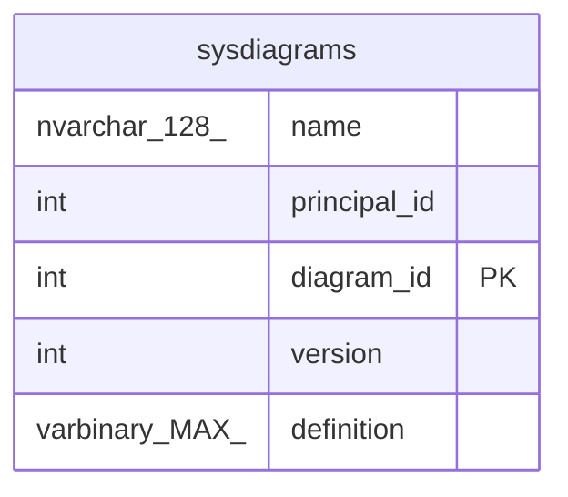

# sysdiagrams

## Description

## Columns

| Name | Type | Default | Nullable | Children | Parents | Comment |
| ---- | ---- | ------- | -------- | -------- | ------- | ------- |
| name | nvarchar(128) |  | false |  |  |  |
| principal_id | int |  | false |  |  |  |
| diagram_id | int |  | false |  |  |  |
| version | int |  | true |  |  |  |
| definition | varbinary(MAX) |  | true |  |  |  |

## Constraints

| Name | Type | Definition |
| ---- | ---- | ---------- |
| PK__sysdiagr__C2B05B616B24EA82 | PRIMARY KEY | CLUSTERED, unique, part of a PRIMARY KEY constraint, [ diagram_id ] |

## Indexes

| Name | Definition |
| ---- | ---------- |
| PK__sysdiagr__C2B05B616B24EA82 | CLUSTERED, unique, part of a PRIMARY KEY constraint, [ diagram_id ] |
| UK_principal_name | NONCLUSTERED, unique, [ principal_id, name ] |

## Relations

---

> Generated by [tbls](https://github.com/k1LoW/tbls)
