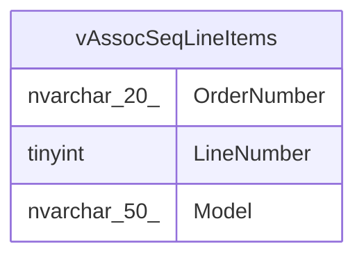

# vAssocSeqLineItems

## Description

<details>
<summary><strong>Table Definition</strong></summary>

```sql
CREATE VIEW [dbo].[vAssocSeqLineItems]
AS
SELECT     OrderNumber, LineNumber, Model
FROM         dbo.vDMPrep
WHERE     (FiscalYear = '2013')

```

</details>

## Columns

| Name | Type | Default | Nullable | Children | Parents | Comment |
| ---- | ---- | ------- | -------- | -------- | ------- | ------- |
| OrderNumber | nvarchar(20) |  | false |  |  |  |
| LineNumber | tinyint |  | false |  |  |  |
| Model | nvarchar(50) |  | true |  |  |  |

## Referenced Tables

| Name | Columns | Comment | Type |
| ---- | ------- | ------- | ---- |
| [dbo.vDMPrep](dbo.vDMPrep.md) | 0 |  |  |

## Relations



---

> Generated by [tbls](https://github.com/k1LoW/tbls)
