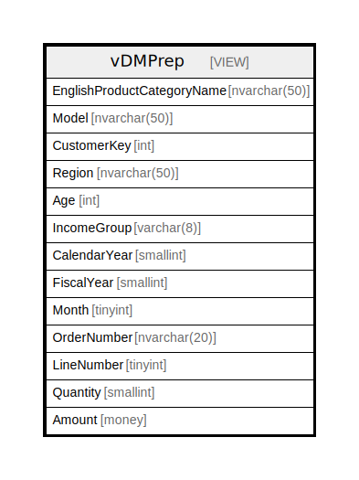

# vDMPrep

## Description

<details>
<summary><strong>Table Definition</strong></summary>

```sql


-- vDMPrep will be used as a data source by the other data mining views.  
-- Uses DW data at customer, product, day, etc. granularity and
-- gets region, model, year, month, etc.
CREATE VIEW [dbo].[vDMPrep]
AS
    SELECT
        pc.[EnglishProductCategoryName]
        ,Coalesce(p.[ModelName], p.[EnglishProductName]) AS [Model]
        ,c.[CustomerKey]
        ,s.[SalesTerritoryGroup] AS [Region]
        ,CASE
            WHEN Month(GetDate()) < Month(c.[BirthDate])
                THEN DateDiff(yy,c.[BirthDate],GetDate()) - 1
            WHEN Month(GetDate()) = Month(c.[BirthDate])
            AND Day(GetDate()) < Day(c.[BirthDate])
                THEN DateDiff(yy,c.[BirthDate],GetDate()) - 1
            ELSE DateDiff(yy,c.[BirthDate],GetDate())
        END AS [Age]
        ,CASE
            WHEN c.[YearlyIncome] < 40000 THEN 'Low'
            WHEN c.[YearlyIncome] > 60000 THEN 'High'
            ELSE 'Moderate'
        END AS [IncomeGroup]
        ,d.[CalendarYear]
        ,d.[FiscalYear]
        ,d.[MonthNumberOfYear] AS [Month]
        ,f.[SalesOrderNumber] AS [OrderNumber]
        ,f.SalesOrderLineNumber AS LineNumber
        ,f.OrderQuantity AS Quantity
        ,f.ExtendedAmount AS Amount  
    FROM
        [dbo].[FactInternetSales] f
    INNER JOIN [dbo].[DimDate] d
        ON f.[OrderDateKey] = d.[DateKey]
    INNER JOIN [dbo].[DimProduct] p
        ON f.[ProductKey] = p.[ProductKey]
    INNER JOIN [dbo].[DimProductSubcategory] psc
        ON p.[ProductSubcategoryKey] = psc.[ProductSubcategoryKey]
    INNER JOIN [dbo].[DimProductCategory] pc
        ON psc.[ProductCategoryKey] = pc.[ProductCategoryKey]
    INNER JOIN [dbo].[DimCustomer] c
        ON f.[CustomerKey] = c.[CustomerKey]
    INNER JOIN [dbo].[DimGeography] g
        ON c.[GeographyKey] = g.[GeographyKey]
    INNER JOIN [dbo].[DimSalesTerritory] s
        ON g.[SalesTerritoryKey] = s.[SalesTerritoryKey] 
;


```

</details>

## Columns

| Name | Type | Default | Nullable | Children | Parents | Comment |
| ---- | ---- | ------- | -------- | -------- | ------- | ------- |
| EnglishProductCategoryName | nvarchar(50) |  | false |  |  |  |
| Model | nvarchar(50) |  | true |  |  |  |
| CustomerKey | int |  | false |  |  |  |
| Region | nvarchar(50) |  | true |  |  |  |
| Age | int |  | true |  |  |  |
| IncomeGroup | varchar(8) |  | false |  |  |  |
| CalendarYear | smallint |  | false |  |  |  |
| FiscalYear | smallint |  | false |  |  |  |
| Month | tinyint |  | false |  |  |  |
| OrderNumber | nvarchar(20) |  | false |  |  |  |
| LineNumber | tinyint |  | false |  |  |  |
| Quantity | smallint |  | false |  |  |  |
| Amount | money |  | false |  |  |  |

## Referenced Tables

| Name | Columns | Comment | Type |
| ---- | ------- | ------- | ---- |
| [[dbo].[FactInternetSales]](%5Bdbo%5D.%5BFactInternetSales%5D.md) | 0 |  |  |
| [[dbo].[DimDate]](%5Bdbo%5D.%5BDimDate%5D.md) | 0 |  |  |
| [[dbo].[DimProduct]](%5Bdbo%5D.%5BDimProduct%5D.md) | 0 |  |  |
| [[dbo].[DimProductSubcategory]](%5Bdbo%5D.%5BDimProductSubcategory%5D.md) | 0 |  |  |
| [[dbo].[DimProductCategory]](%5Bdbo%5D.%5BDimProductCategory%5D.md) | 0 |  |  |
| [[dbo].[DimCustomer]](%5Bdbo%5D.%5BDimCustomer%5D.md) | 0 |  |  |
| [[dbo].[DimGeography]](%5Bdbo%5D.%5BDimGeography%5D.md) | 0 |  |  |
| [[dbo].[DimSalesTerritory]](%5Bdbo%5D.%5BDimSalesTerritory%5D.md) | 0 |  |  |

## Relations



---

> Generated by [tbls](https://github.com/k1LoW/tbls)
