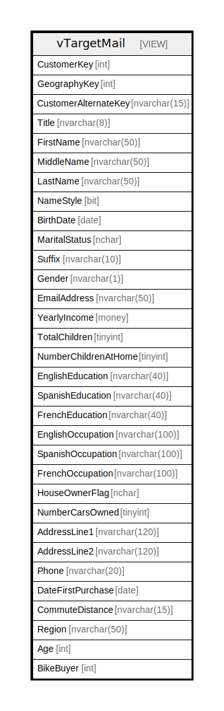

# vTargetMail

## Description

<details>
<summary><strong>Table Definition</strong></summary>

```sql

-- vTargetMail supports targeted mailing data model
-- Uses vDMPrep to determine if a customer buys a bike and joins to DimCustomer
CREATE VIEW [dbo].[vTargetMail] 
AS
    SELECT
        c.[CustomerKey], 
        c.[GeographyKey], 
        c.[CustomerAlternateKey], 
        c.[Title], 
        c.[FirstName], 
        c.[MiddleName], 
        c.[LastName], 
        c.[NameStyle], 
        c.[BirthDate], 
        c.[MaritalStatus], 
        c.[Suffix], 
        c.[Gender], 
        c.[EmailAddress], 
        c.[YearlyIncome], 
        c.[TotalChildren], 
        c.[NumberChildrenAtHome], 
        c.[EnglishEducation], 
        c.[SpanishEducation], 
        c.[FrenchEducation], 
        c.[EnglishOccupation], 
        c.[SpanishOccupation], 
        c.[FrenchOccupation], 
        c.[HouseOwnerFlag], 
        c.[NumberCarsOwned], 
        c.[AddressLine1], 
        c.[AddressLine2], 
        c.[Phone], 
        c.[DateFirstPurchase], 
        c.[CommuteDistance], 
        x.[Region], 
        x.[Age], 
        CASE x.[Bikes] 
            WHEN 0 THEN 0 
            ELSE 1 
        END AS [BikeBuyer]
    FROM
        [dbo].[DimCustomer] c INNER JOIN (
            SELECT
                [CustomerKey]
                ,[Region]
                ,[Age]
                ,Sum(
                    CASE [EnglishProductCategoryName] 
                        WHEN 'Bikes' THEN 1 
                        ELSE 0 
                    END) AS [Bikes]
            FROM
                [dbo].[vDMPrep] 
            GROUP BY
                [CustomerKey]
                ,[Region]
                ,[Age]
            ) AS [x]
        ON c.[CustomerKey] = x.[CustomerKey]
;


```

</details>

## Columns

| Name | Type | Default | Nullable | Children | Parents | Comment |
| ---- | ---- | ------- | -------- | -------- | ------- | ------- |
| CustomerKey | int |  | false |  |  |  |
| GeographyKey | int |  | true |  |  |  |
| CustomerAlternateKey | nvarchar(15) |  | false |  |  |  |
| Title | nvarchar(8) |  | true |  |  |  |
| FirstName | nvarchar(50) |  | true |  |  |  |
| MiddleName | nvarchar(50) |  | true |  |  |  |
| LastName | nvarchar(50) |  | true |  |  |  |
| NameStyle | bit |  | true |  |  |  |
| BirthDate | date |  | true |  |  |  |
| MaritalStatus | nchar |  | true |  |  |  |
| Suffix | nvarchar(10) |  | true |  |  |  |
| Gender | nvarchar(1) |  | true |  |  |  |
| EmailAddress | nvarchar(50) |  | true |  |  |  |
| YearlyIncome | money |  | true |  |  |  |
| TotalChildren | tinyint |  | true |  |  |  |
| NumberChildrenAtHome | tinyint |  | true |  |  |  |
| EnglishEducation | nvarchar(40) |  | true |  |  |  |
| SpanishEducation | nvarchar(40) |  | true |  |  |  |
| FrenchEducation | nvarchar(40) |  | true |  |  |  |
| EnglishOccupation | nvarchar(100) |  | true |  |  |  |
| SpanishOccupation | nvarchar(100) |  | true |  |  |  |
| FrenchOccupation | nvarchar(100) |  | true |  |  |  |
| HouseOwnerFlag | nchar |  | true |  |  |  |
| NumberCarsOwned | tinyint |  | true |  |  |  |
| AddressLine1 | nvarchar(120) |  | true |  |  |  |
| AddressLine2 | nvarchar(120) |  | true |  |  |  |
| Phone | nvarchar(20) |  | true |  |  |  |
| DateFirstPurchase | date |  | true |  |  |  |
| CommuteDistance | nvarchar(15) |  | true |  |  |  |
| Region | nvarchar(50) |  | true |  |  |  |
| Age | int |  | true |  |  |  |
| BikeBuyer | int |  | false |  |  |  |

## Referenced Tables

| Name | Columns | Comment | Type |
| ---- | ------- | ------- | ---- |
| [[dbo].[DimCustomer]](%5Bdbo%5D.%5BDimCustomer%5D.md) | 0 |  |  |
| [[dbo].[vDMPrep]](%5Bdbo%5D.%5BvDMPrep%5D.md) | 0 |  |  |

## Relations



---

> Generated by [tbls](https://github.com/k1LoW/tbls)
